# Сервис интеграции (Mock-сервис)

[](https://opensource.org/licenses/MIT)
[](https://github.com/rzateev/1cServiceIntegrationMock)
> [English Version](README_EN.md) - "1C Integration Service (Mock)"

> Реализация транспортного уровня для технологии «Сервис интеграции» платформы 1С:Предприятие. 
Open-source решение, позволяющее быстро развернуть окружение и настроить приложения и каналы сервиса интеграции, совместимые с 1С, для тестирования различных интеграционных сценариев.

## 🎯 Назначение

Проект предоставляет готовое окружение для разработки и тестирования сценариев с использованием технологии **«Сервис интеграции»** платформы 1С:Предприятие.

Решение позволяет:
- Развернуть локальное окружение с транспортным уровнем (AMQP 1.0) с использованием готовых Docker-контейнеров.
- Предоставляет готовый UI и API для создания приложений и каналов, доступных для подключения из 1С как сервисы интеграции — с настройкой как в конфигураторе, так и в режиме "Предприятие".
- Тестировать взаимодействие с сервисом интеграции по тем же протоколам и принципам, что использует платформа 1С, с помощью Node.js-приложения.
- Запускать обмен сообщениями как между конфигурациями 1С, так и с внешними сервисами, поддерживающими AMQP 1.0, используя упрощённые механизмы настройки.
- Использовать расширение для 1С (входит в комплект) для автоматической настройки сервиса интеграции, проведения функционального и минимального нагрузочного тестирования с контролем доставки сообщений.
- Из 1С напрямую создавать и настраивать внешнее приложение сервиса интеграции, совместимое с внутренним сервисом интеграции конфигурации.
- Изучать работу сервисов интеграции благодаря подробной документации по архитектуре решения и внутренним механизмам платформы 1С.

### В комплекте
- **Приложение на Node.js** — регистрация приложений, создание пользователей в брокере сообщений, выдача токенов, получение списка каналов, вспомогательные функции для интеграции с 1С, тестовые инструменты отправки и получения сообщений.
- **AMQP-брокер сообщений** — совместимый с платформой 1С настроенный и готовый брокер с поддержкой AMQP 1.0.
- **Расширение для 1С** (в разработке) — автоматическая настройка сервиса интеграции, отправка и приём сообщений из 1С.

### Ценность для разработчика
- Быстрый старт без погружения в детали реализации сервиса интеграции, совместимого с платформой по нативному протоколу AMQP 1.0.
- Организация локального цикла разработки с использованием сервисов интеграции.
- Возможность отладки транспортного уровня взаимодействия без применения продукта «1С:Шина».
- Поддержка полноценных e2e-сценариев обмена.
- Более глубокое понимание механизмов платформы 1С и её возможностей по организации надёжного обмена в асинхронной событийно-ориентированной архитектуре.
- Осознание ценности интеграций через нативные сервисы и «1С:Шину» как промышленный продукт.


#### **Компоненты решения:**

*   **Mock-сервис:** Сервис интеграции, эмулирующий внешний сервис 1С
*   **Веб-интерфейс:** Управление конфигурациями, тестирование и мониторинг
*   **Расширение для 1С:** Расширение для 1С:Предприятие
*   **Функциональность:** Формы и методы для тестирования отправки и получения данных
*   **Преимущество:** Отладка логики интеграции в среде разработки без влияния на продуктивные системы

#### **Технологии:**
**Node.js (Backend) + React (Frontend) + Apache ActiveMQ Artemis (Брокер сообщений)**

> **Технические детали:** Подробная информация об архитектуре и технологиях реализации доступна в разделе [Архитектура системы](docs/SystemArchitecture.md).

> Исходный код расширения находится в директории `[1cServIntTestExt\src]`.

**Ключевые возможности:**
- ✅ **Локальная разработка** - Интеграционное окружение на локальной машине
- ✅ **Обучение** - Изучение механизмов сервисов интеграции 1С, паттернов InboxTable/OutboxTable, протокола AMQP 1.0, аутентификации OIDC, конфигурации сервисов, маршрутизации сообщений и управления очередями
- ✅ **Тестирование** - Локальное тестирование интеграционного кода перед развертыванием
- ✅ **Открытая архитектура** - Изучение реализации интеграционных паттернов
- ✅ **Нагрузочное тестирование** - Оценка производительности интеграционных сценариев


## 🏗️ Архитектура и компоненты

Этот mock-сервис реализует ключевые компоненты, необходимые для взаимодействия с внешним сервисом интеграции из приложений на платформе 1С:

- **[Архитектура системы](docs/SystemArchitecture.md)** - Полная архитектура системы со связями между компонентами.
- **[Диаграмма потоков сообщений](docs/MessageFlowDiagram.md)** - Детальная последовательность обмена сообщениями.

### Компоненты системы

| Компонент | URL | Порт | Описание |
|---|---|---|---|
| **Frontend Mock Bus** | http://localhost:3090 | 3090 | Веб-интерфейс для настройки и тестирования (admin/admin) |
| **API Mock Bus** | http://localhost:9090 | 9090 | REST API для конфигурации сервисов и аутентификации по OIDC |
| **Artemis AMQP** | amqp://localhost:6698 | 6698 | Брокер сообщений Apache Artemis с протоколом AMQP 1.0 |
| **Веб-консоль Artemis** | http://localhost:8161 | 8161 | UI для мониторинга и управления брокером (artemis/artemis) |
| **API пользователей Artemis** | http://localhost:8162 | 8162 | Расширенный REST API/UI для управления пользователями |
| **MongoDB** | mongodb://localhost:27017 | 27017 | База данных для хранения настроек сервиса интеграции |


## 🚀 Быстрый старт

### Требования
- Платформа 1С:Предприятие не ниже 8.3.17
- Node.js
- Docker & Docker Compose
- Git, Git Bash (для Windows)
- IDE (VSCode, Cursor, etc) - по желанию

### Установка

> **Важно:** В Windows предпочтительно использовать Git Bash либо IDE (VSCode, Cursor, etc) при выполнении команд в терминале. Дополнительно ознакомьтесь с [CrossPlatformSetup.md](docs/CrossPlatformSetup.md).

```bash
# Клонировать репозиторий
git clone https://github.com/rzateev/1cServiceIntegrationMock.git
cd 1cServiceIntegrationMock


#Создайте файл `.env` на основе `.env.example`.
cp .env.example .env


# Запустить все сервисы
docker-compose up -d

# Внимание! В случае использования Mac M1-M4 используйте следующую строку запуска: DOCKER_DEFAULT_PLATFORM=linux/arm64 docker-compose up -d

# Проверить статус
docker-compose ps
```


## ⚙️ Типовой сценарий работы для поставляемого тестового приложения

### Настройка тестового приложения и проверка корректности настройки 
1.  **Запуск окружения**: После выполнения `docker-compose up -d`, откройте **Frontend Mock Bus** по адресу `http://localhost:3090`.

    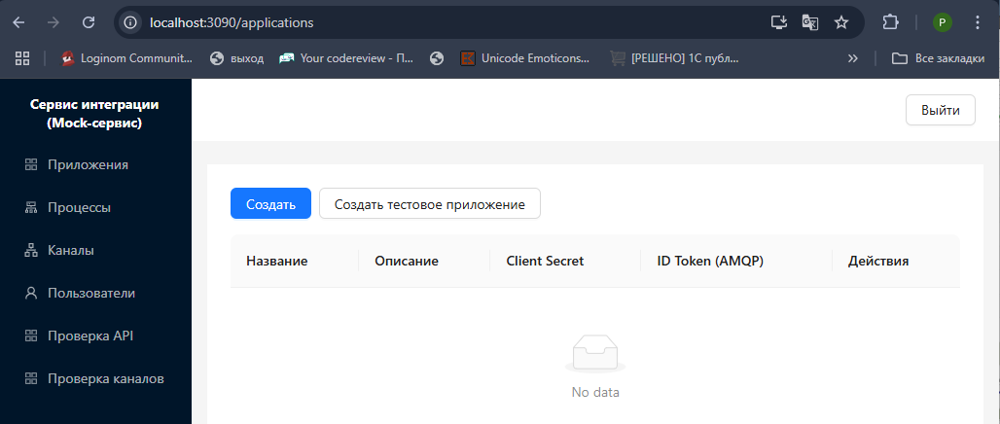
2.  **Генерация тестовой конфигурации**: Перейдите на страницу **Приложения** и нажмите кнопку `Создать тестовое приложение` для генерации тестового набора.
3.  **Создание тестового приложения**: Система создаст тестовое приложение, процессы и каналы, зарегистрирует в базе данных и создаст пользователей и очереди в Artemis.

    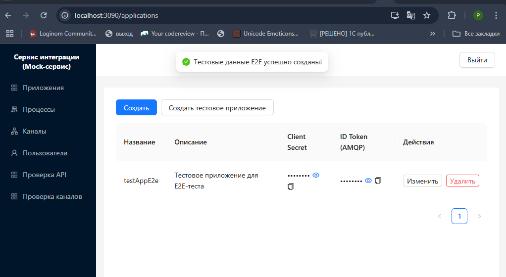


    **Конкретные значения тестового приложения:**
    - **Приложение**: `testAppE2e` с описанием "Тестовое приложение для E2E-теста". Используйте как имя пользователя при настройке сервиса интеграции в 1С.
    - **ClientSecret**: генерируется автоматически как 16-байтный hex-токен (32 символа, например, `68bdf9565056a16f21615505c3cae5a6`)
    - **id_token**: генерируется автоматически как 32-байтный base64-токен. Например, `B0fKm9xmQNXZxkBOhkKCYndP2Ng0rV2Y29OYa76lEFUz`
    - **Процесс**: `e1c::ТестовыйПроект::Основной::OfficeToShop` (имитирует структуру 1С)
    - **Каналы**: 
        - Исходящий: `e2eOutOfficeToOffice` с destination `OfficeToOffice` (тип `outbound`) — для отправки сообщений в очередь, которая будет автоматически обрабатываться consumer'ом
        - Исходящий: `e2eOutOfficeToShop` с destination `OfficeToShop` (тип `outbound`) — для отправки сообщений в очередь без автоматического потребления (для просмотра в консоли Artemis)
      - Входящий: `e2eInOfficeToOffice` с destination `OfficeToOffice` (тип `inbound`) — для получения сообщений из очереди OfficeToOffice
  
   **Автоматически выполняются следующие операции:**
      - Создание пользователя в Artemis с именем и паролем равными `id_token`
      - Создание адресов `OfficeToOffice` и `OfficeToShop` с типом маршрутизации `ANYCAST` (point-to-point)
      - Создание очередей `OfficeToOffice` и `OfficeToShop` в соответствующих адресах (durable=true)
      - Регистрация в MongoDB с полной иерархией: Application → Process → Channels
4.  **Проверка подключения по API**: Используйте страницу **Проверка API** для симуляции запросов от 1С. Получите метаданные каналов и runtime-конфигурацию для проверки настроек mock-сервиса.

   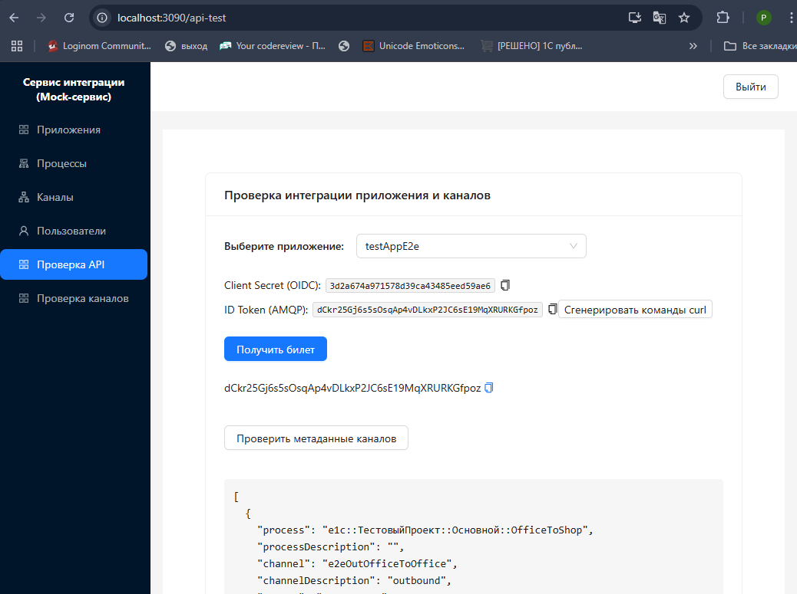

5.  **Отправка тестового сообщения**: Перейдите на страницу **Проверка каналов**, выберите тестовое приложение, выберите канал, отобразится очередь, которая соответствует каналу в брокере сообщений Actice MQ. Заполните текст сообщения, выполните отправку в брокер.

    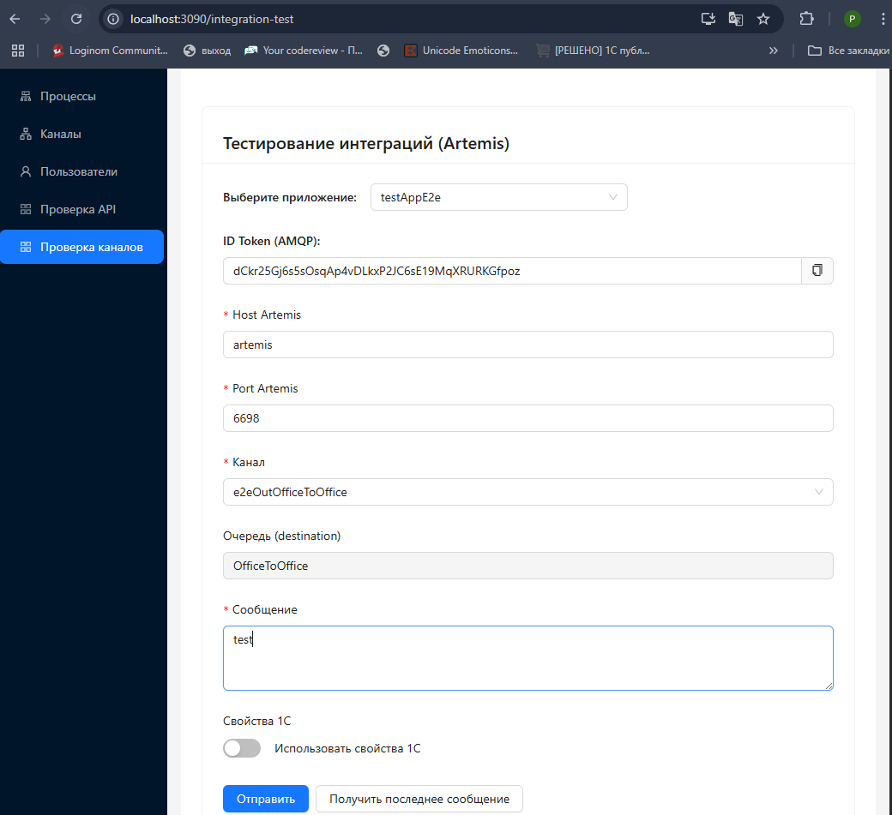

6.  **Проверка и получение**: Откройте **веб-консоль Artemis** (`http://localhost:8161`), проверьте доставку сообщения в очередь (вкладка Queues). Вернитесь на **Проверка каналов** и нажмите "Получить последнее сообщение" для чтения из очереди. Вы должны увидеть текст сообщения, которое ранее отправляли в очередь. При этом в консоли брокера в очереди будет отображаться информация о доставке сообщения.

### Проверка с помощью расширения 1С
1.  **Установка расширения**: Установите расширение для 1С:Предприятие.
2.  **Настройка тестового сервиса**: 

**Вариант 1:**
В режиме Предприятие настройте сервис интеграции через обработку "Управление сервисами интеграции". Используйте `Название приложения` как имя пользователя, `ClientSecret` как пароль и URL-адреса из фронтенда. После настройки можно тестировать отправку и получение сообщений с помощью расширения.
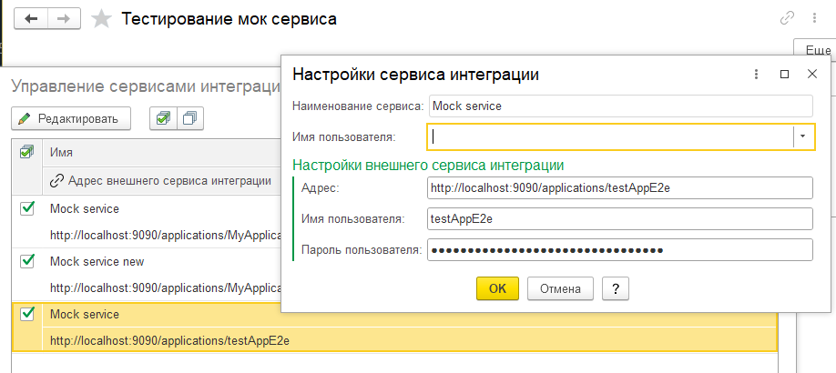

**Вариант 2:**
Откройте обработку "Тестирование сервиса" из расширения (раздел "Service Integration (Mock)")
- На вкладке "Параметры" будут отображены параметры по-умолчанию, соответствующие нашему тестовому окружению. При необходимости можно поменять URL, логи и пароль для подключения к бекэнд сервиса интеграции.

   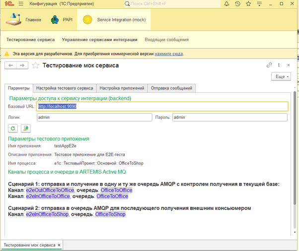
- На вкладке "Настройка тестового сервиса" нажмите сначала кнопку "Создать тестовое приложение (в Moock-сервисе))" 
- Затем  нажмите кнопку "Настроить сервис интеграции (в 1С)"

   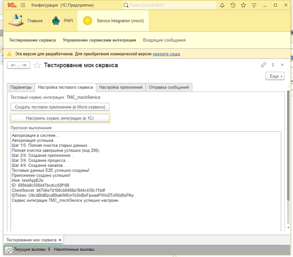

1.  **Отправка сообщений**: Откройте обработку "Тестирование сервиса" из расширения (раздел "Service Integration (Mock)"). На вкладке "Отправка сообщений" укажите количество сообщений, которые необходимо отправить, укажите сервис интеграции "ТМС_mockService"и канал e2eOfficeToOffice и нажмите кнопку "Отправить сообщения (сохранить в очередь IntegChannelOutQueue)". В этот момент сообщения будут сохранены в очереди отправляемых сообщений в базе данных приложения 1С (имплементация паттерна OutboxTable).

   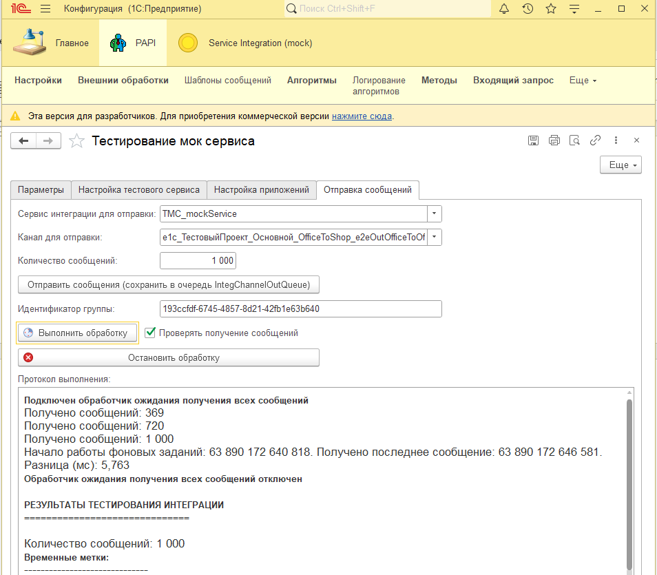


Примечание: можете проверить с помощью расширения PAPI и обработки "Сообщения сервисов интеграции". Ссылка на пакет расширения: https://github.com/dsdred/PAPI


2.  **Запуск технических регламентных заданий**: Установите признак "Проверять получение сообщений". Выполните команду "Выполнить обработку". В этот момент будут запущены три технических фоновых задания, которыми управляет платформа 1С. Сообщения из внутренней таблицы IntegChannelOutQueue с ранее сформированными сообщениями будут отправлены в брокер сообщений Artemis.
Для контроля корректности работы интеграционного потока вы можете зайти в консоль Artemis и проверить следующие сущности:
- Connections: вы должны увидеть два подключения, соответствующих двух фоновым заданиям (обработка входящей и исходящей очереди сообщений) 

   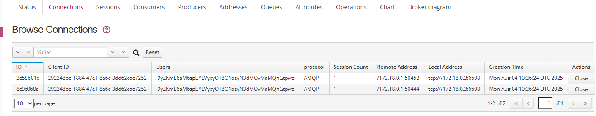

- Sessions: также две сессии с разными идентификаторами (аналогично Connections))

   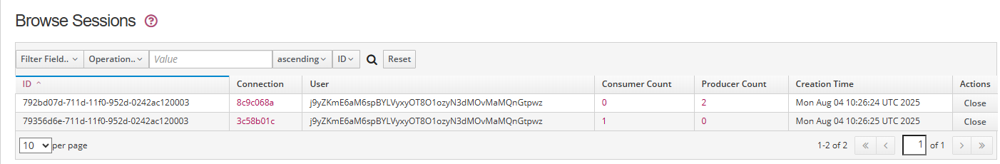
- Producers: вы должны увидеть одну строку с producer, который соответсвует фоновому заданию, которое занимается отправкой сообщений в очередь

   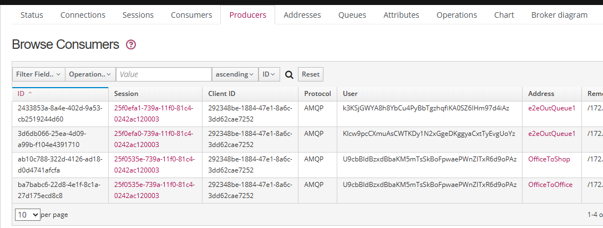
- Consumers: вы должны увидеть одну строку с consumer, который соответсвует фоновому заданию, которое занимается получением сообщений из очереди

   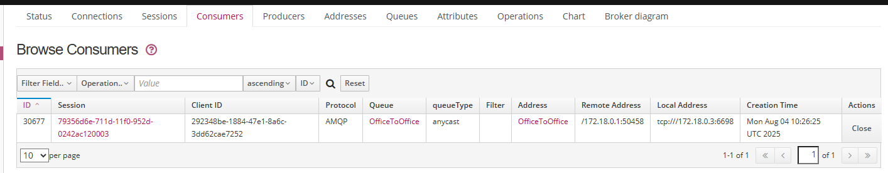
- Queues: вы должны увидеть очереди OfficeToOffice и OfficeToShop. В соответствии с настройкой тестового приложения эти очереди используются для различных сценариев тестирования

   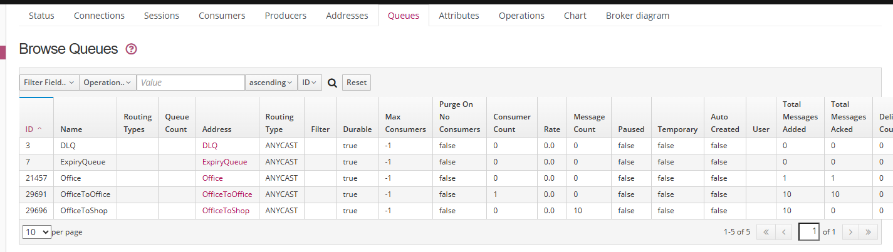
- Browse Messages: вы можете посмотреть сообщения в очереди, если из нее сообощения еще не были получены consumer

   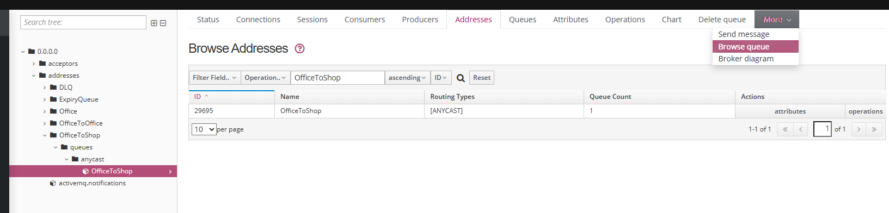

   Список сообщений в очереди OfficeToShop

   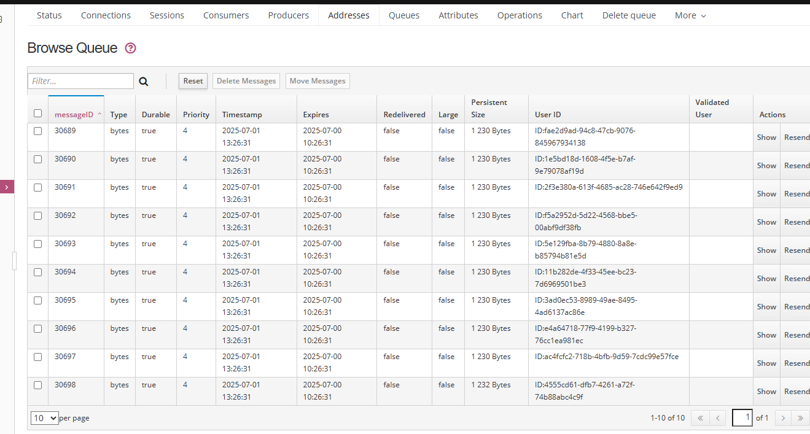

   Также можно посмотреть содержимое сообщений в очереди OfficeToOffice

   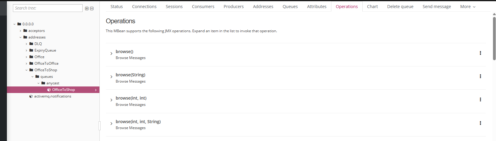

   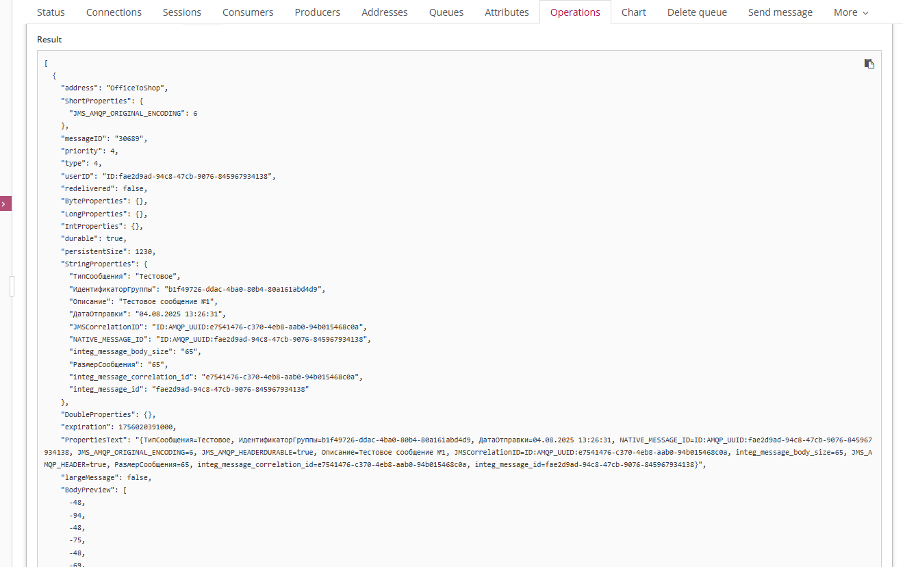


1.  **Проверка получения сообщений**: Так как технические фоновые задания запускаются параллельно, то сразу после отправки сообщения из очереди в брокере сообщений Artemis, будут получены в техническую таблицу входящей очереди сообщений IntegChannelInQueue, после успешного сохранения платформа 1С уведомит брокер об успешном получении сообщения.
   В процессе отправки сообщений из 1С мы запускаем обработчик ожидания (если установлена галочка "Проверять получение сообщений"), который контролирует получение сообщений из очереди и запись их во вспомогательный регистр сведений "Входящие сообщения", уведомляет нас о получении всех сообщений из группы сообщений и выводит статистику по отправке и получению сообщений.

   Откройте регистр сведений "Входящие сообщения" и убедитесь, что сообщения были получены.

   Откройте список очередей в разделе Queues и убедитесь, что в очереди OfficeToOffice сообщения были получены consumer: значения полей `Total Messages Added` равно `Total Messages Acked`. В очереди OfficeToShop сообщения останутся для просмотра в консоли

2.  **Проверка времени жизни соединений при работе фоновых заданий**: По истечении 2-х минут если вы повторно не нажимали кнопку "Выполнить обработку", то соединения с брокером сообщений Artemis должны быть закрыты.
Можете через минуту нажать кнопку "Выполнить обработку" и убедиться, что соединения с брокером сообщений Artemis открыты.


## ⚙️ Настройка приложения для существующего сервиса интеграции в приложении 1С и проведение тестирования

Откройте обработку "Тестирование сервиса" из расширения (раздел "Service Integration (Mock)"). На вкладке "Настройка приложений" выберите существующий в вашем приложении 1С сервис интеграции, который вы хотите протестировать.
Укажите имя приложения в mock-сервисе, которое соответствует сервису интеграции в 1С. По умолчанию будет использоваться тестовое приложение `MyApplication`.
Нажмите кнопку "Создать и настроить по метаданным" и система автоматически создаст приложения, процессы и каналы в mock-сервисе.

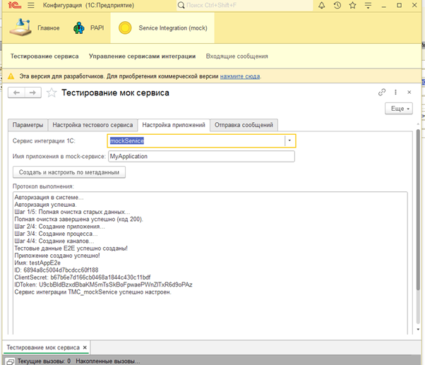

Соданные параметры приложения вы можете проверить и при необходимости скорректировать (названия очередей) в фронт-энде mock-сервиса по адресу `http://localhost:3090/`.
После чего вы можете тестировать отправку сообщений в этот сервис на вкладке "Отправка сообщений".

Примечание - в этом случае создаются отдельные каналы для отправки и получения сообщений в соответствии с метаданными сервиса интеграции в 1С.
По-умолчанию вам будет доступна только отправка сообщений в сервис интеграции, так как названия очередей для входящих и исходящих каналов будут не совпадать.
После отправки вы можете с помощью скрипта `scripts/office-to-shop-consumer.js` проверить получение сообщений из очереди OfficeToShop. Для этого вам необходимо скопировать скрипт и изменить название очереди в скрипте, как она будет называться в созданном приложении и запустить его.


## 🔧 Особенности mock-сервиса

### Автоматизация инфраструктуры
- Правильно сконфигурированный контейнер брокера сообщений Artemis с учетом особенностей работы платформы 1С при работе с сервисами интеграции
- Автоматическое создание пользователей Artemis при конфигурировании параметров приложения в сервисе интеграции. Автоматическая генерация `id_token` для аутентификации по AMQP
- Автоматическое создание и управление очередями AMQP для каналов
- Автоматическое пересоздание очереди при изменении адреса назначения канала
- Автоматическая синхронизация данных между MongoDB и контейнером Artemis при запуске системы

### Дополнительная валидация конфигурации
- Проверка существования приложения и валидация токенов
- Предотвращение удаления каналов с активными сообщениями


### Технические особенности
- Очереди сообщений используют маршрутизацию ANYCAST
- Имя приложения используется в качестве имени пользователя для аутентификации
- Имя пользователя и пароль для аутентификации по AMQP равны полю `id_token`

## 📚 Описание основного API

### Эндпоинты сервиса интеграции
- `POST /auth/oidc/token` - Аутентификация OIDC.
- `GET /applications/{app}/sys/esb/metadata/channels` - Метаданные каналов (используется в режиме Конфигуратора 1С для загрузка данных каналов сервиса интеграции).
- `GET /applications/{app}/sys/esb/runtime/channels` - Runtime-конфигурация каналов (используется техническими фоновыми заданиями 1С для получения runtime-конфигурации каналов сервиса интеграции).


Полную документацию смотрите в папке [docs/](docs/).


## 📖 Примеры использования

### 1. Аутентификация по OIDC
```bash
# Аутентификация 1С в сервисах интеграции
curl -X POST http://localhost:9090/auth/oidc/token \
  -H "Content-Type: application/x-www-form-urlencoded" \
  -H "Authorization: Basic <base64-encoded-credentials>" \
  -d "grant_type=client_credentials"
```

**Генерация base64-encoded-credentials:**
```bash
# Способ 1: Используя echo и base64 (Linux/macOS)
echo -n "ClientId:ClientSecret" | base64

# Способ 2: Используя printf и base64 (Linux/macOS)
printf "%s" "ClientId:ClientSecret" | base64

# Способ 3: Используя PowerShell (Windows)
[Convert]::ToBase64String([Text.Encoding]::UTF8.GetBytes("ClientId:ClientSecret"))

# Способ 4: Онлайн-генератор
# Перейдите на http://localhost:3090/api-test и используйте встроенный генератор команд
```

**Пример для тестового приложения:**
```bash
# ClientId: testAppE2e, ClientSecret: 68bdf9565056a16f21615505c3cae5a6
echo -n "testAppE2e:68bdf9565056a16f21615505c3cae5a6" | base64
# Результат: dGVzdEFwcEUyZTo2OGJkZjk1NjUwNTZhMTZmMjE2MTU1MDVjM2NhZTVhNg==
```

### 2. Обнаружение конфигурации сервиса
```bash
# Обнаружение доступных сервисов интеграции 1С
curl -H "Authorization: Bearer <token>" \
  http://localhost:9090/applications/myApp/sys/esb/runtime/channels
```

### 3. Тестирование обмена сообщениями
```bash
# Базовый E2E тест
npm run e2e

# Тестирование получения сообщений из очереди OfficeToShop
npm run office-consumer

# Демонстрационный тест с полным циклом
npm run office-demo

# Нагрузочное тестирование
npm run perf-producer  # отправка сообщений
npm run perf-consumer  # получение сообщений
```

## 🛠️ Разработка

### Структура проекта
```
├── artemis-container/     # Брокер сообщений Artemis + REST API для управления пользователями
├── mock-bus-container/    # Реализация API сервиса интеграции и UI для настройки приложений и каналов (Node.js + React)
├── scripts/              # Инструменты для интеграционного и нагрузочного тестирования
│   ├── e2e-test.js                   # E2E тест создания приложения и отправки сообщений
│   ├── office-to-shop-consumer.js    # Consumer для получения сообщений из очереди OfficeToShop
│   ├── test-office-to-shop-flow.js   # Демо-тест полного цикла OfficeToShop
│   ├── performance-producer.js       # Нагрузочное тестирование отправки
│   ├── performance-consumer.js       # Нагрузочное тестирование получения
│   └── run-performance-test.js       # Комплексное тестирование производительности
├── docs/                 # Документация
└── docker-compose.yml    # Окружение для локальной разработки
```

## 🧪 Тестирование

### End-to-End тестирование
```bash
npm install
# Полный E2E тест с созданием приложения и отправкой сообщений
npm run e2e
# или
node scripts/e2e-test.js
```

**E2E тест (`e2e-test.js`)** выполняет:
- Создание тестового приложения `testAppE2e` с процессами и каналами
- Получение OIDC токена для аутентификации
- Получение runtime-конфигурации каналов
- Подключение к AMQP брокеру и отправку тестового сообщения
- Проверку полного цикла взаимодействия с сервисом интеграции

### Тестирование получения сообщений из очереди OfficeToShop
```bash
# Запуск consumer для получения сообщений из очереди OfficeToShop
npm run office-consumer

# Демонстрационный тест (создает окружение + отправляет сообщения + получает их)
npm run office-demo
```

**Office-To-Shop Consumer (`office-to-shop-consumer.js`)** предоставляет:
- Автоматическое подключение к тестовому приложению `testAppE2e`
- Получение сообщений из AMQP очереди с acknowledge
- Детальные замеры времени обработки каждого сообщения
- Статистика производительности (сообщений/сек, мин/макс время обработки)
- Автоматическое сохранение результатов в JSON файлы

**Документация:** [README-office-to-shop-consumer.md](scripts/README-office-to-shop-consumer.md)

### Нагрузочное тестирование
```bash
# Тестирование производительности отправки
npm run perf-producer
# или
node scripts/performance-producer.js

# Тестирование производительности получения
npm run perf-consumer
# или
node scripts/performance-consumer.js

# Комплексное тестирование производительности
npm run perf-test
# или
node scripts/run-performance-test.js
```

**Производительность mock-сервиса (скрипт на node.js):**
- **Пропускная способность (отправка)**: ~3000 сообщений/сек
- **Пропускная способность (получение)**: ~1650-2800 сообщений/сек
- **Время отклика**: < 1-10 мс на сообщение
- **Надежность**: 0% потерь сообщений


## 🔍 Мониторинг

### Мониторинг mock-сервиса
```bash
# Мониторинг всех сервисов интеграции
docker-compose logs

# Мониторинг конкретных компонентов
docker-compose logs mock-bus-container
docker-compose logs artemis
```

### Консоль брокера сообщений Artemis

**Адрес:** http://localhost:8161/console/  
**Доступ:** логин `artemis`, пароль `artemis`  
**Примечание:** управление пользователями (создание/изменение) не выполняется через эту веб-консоль в типичной поставке — учётные записи создаются и настраиваются через конфигурацию или внешние скрипты/имплементации (например, из mock-сервиса).

#### Кратко: что нужно понимать перед работой
- **Address (адрес)** — логическая точка маршрутизации сообщений; может иметь несколько очередей.  
- **Queue (очередь)** — связана с адресом и получает сообщения в зависимости от типа маршрутизации.  
- **Routing type**:
  - `anycast` — point-to-point: сообщение доставляется **одному** consumer'у (используется для типового обмена).  
  - `multicast` — publish-subscribe: сообщение доставляется **всем** подписанным очередям/потребителям.  
- **Producer / Consumer** — отправитель и получатель сообщений.  
- **Connection / Session** — канал коммуникации между клиентом (например, 1С) и брокером.

#### Зачем использовать консоль
Консоль Artemis, построенная на Hawt.io, предоставляет визуальный доступ к внутренним сущностям брокера и помогает:
- Увидеть, что сообщения действительно дошли до брокера.
- Проверить корректность маршрутизации (адрес, тип, destination).
- Отладить проблемы с доставкой (например, отсутствие consumer’ов или ack’ов).
- Контролировать состояние фоновых заданий 1С через подключения/сессии.
- Диагностировать проблемы аутентификации, таймаутов и жизненного цикла соединений.
- Анализировать задержки, накопление и потерю сообщений (через сравнение `Total Messages Added` vs `Total Messages Acked`).

#### Разделы и навигация
1. **Queues**  
   - Выберите нужную очередь (например, соответствующую каналу, например `OfficeToOffice` или `OfficeToShop`).  
   - Проверьте, что её адрес и тип (обычно `anycast` для сервисов интеграции) совпадают с настройками канала.  
   - Нажмите `Browse` / `Browse Messages` — можно увидеть необработанные сообщения, их заголовки, тело и свойства.

2. **Message Details**  
   - Клик по конкретному сообщению раскрывает:  
     - Тело сообщения  
     - Заголовки и пользовательские свойства  
     - Метаданные доставки (например, количество попыток, статус)

3. **Connections**  
   - Показывает активные подключения от клиента (1С фоновые задания).  
   - Убедитесь, что появились два соединения/сессии, соответствующие обработке входящих и исходящих очередей.

4. **Sessions**  
   - Сессии внутри соединений; помогает сопоставить, какие producers/consumers работают в рамках конкретных потоков.

5. **Producers / Consumers**  
   - Producer: кто отправляет (фоновые задания 1С на отправку).  
   - Consumer: кто читает (фоновые задания 1С на приём).  
   - Проверяй их активность, особенно если сообщения "застревают".

6. **Metrics / Queue statistics**  
   - `Total Messages Added` vs `Total Messages Acked` — контроль доставки.  
   - Задержки в потреблении, накопление, “мёртвые” сообщения (если используется dead-letter).

## 🚨 Решение проблем

### Частые проблемы
1.  **Проблемы с запуском сервисов**: Проверьте `docker-compose logs`.
2.  **Конфликты портов**: Убедитесь, что порты 3090, 9090, 8161, 8162, 6698 свободны.
3.  **Проблемы с аутентификацией**: Проверьте учетные данные OIDC в файле `.env`.
4.  **Проблемы с маршрутизацией**: Проверьте конфигурацию очередей в консоли Artemis.

### Сброс окружения
```bash
docker-compose down -v
docker-compose build --no-cache
docker-compose up -d
```

## 📄 Лицензия

Этот проект лицензирован под лицензией MIT. Подробности смотрите в файле [LICENSE](LICENSE).

**Разрешения:**
- ✅ Коммерческое использование
- ✅ Модификация
- ✅ Распространение
- ✅ Частное использование

**Условия:**
- 📝 Требуется указание авторства
- 📝 Требуется включение копии лицензии

## 👥 Авторы

- **Разработка**: Роман Затеев
- **Архитектура**: Роман Затеев
- **Документация**: Роман Затеев

---

**Версия**: 1.0.1.2  
**Дата**: 2025-08-07  
**Статус**: В разработке

## 🤝 Участие в проекте

1.  Сделайте форк репозитория.
2.  Создайте ветку для новой функциональности.
3.  Внесите ваши изменения.
4.  Отправьте Pull Request.

## 📚 Дополнительные ресурсы

### Официальная документация 1С
- **[1C:ESB Channel Description API](https://1cmycloud.com/console/help/esb/7.0/docs/topics/get-channel-description/)** - Официальная документация по API метаданных и runtime каналов 1С:Шины.
- **[1C:ESB Integration Bus Documentation](https://1cmycloud.com/console/help/esb/4.1/docs/topics/doc20006.html)** - Отправка и получение сообщений из 1С:Шины.

### Статьи сообщества
- **[Поинтегрируем: сервисы интеграции – новый стандарт или просто коннектор?](https://infostart.ru/1c/articles/2042916/)** - Анализ сервисов интеграции 1С как нового стандарта в сравнении с простым коннектором.
- **[Три инструмента для сервисов интеграции](https://infostart.ru/1c/tools/2050054/)** - Три инструмента для работы с сервисами интеграции 1С.

### Документация mock-сервиса
- **[Внутренняя архитектура 1С](docs/1cInternalArchitecture.md)** - Как 1С:Предприятие работает с сервисами интеграции.
- **[Архитектура системы](docs/SystemArchitecture.md)** - Архитектура и компоненты нашего mock-сервиса.
- **[Диаграмма потоков сообщений](docs/MessageFlowDiagram.md)** - Процесс обмена сообщениями.


## 📞 Поддержка

По вопросам, связанным с сервисами интеграции 1С:
- Создайте issue на GitHub.
- Проверьте документацию в папке `docs/`.
- Изучите раздел "Решение проблем" выше.

---

**Отказ от ответственности**: Этот проект демонстрирует паттерны работы сервисов интеграции 1С в образовательных целях. "1С" является зарегистрированным товарным знаком компании "1С".
