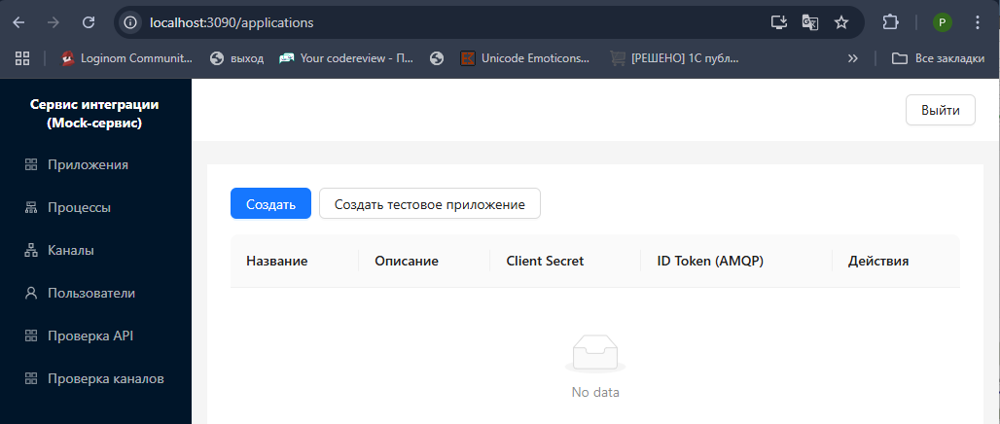
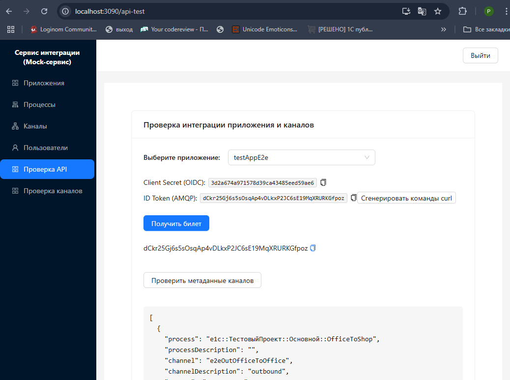
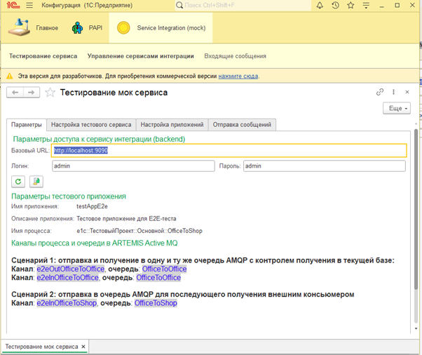
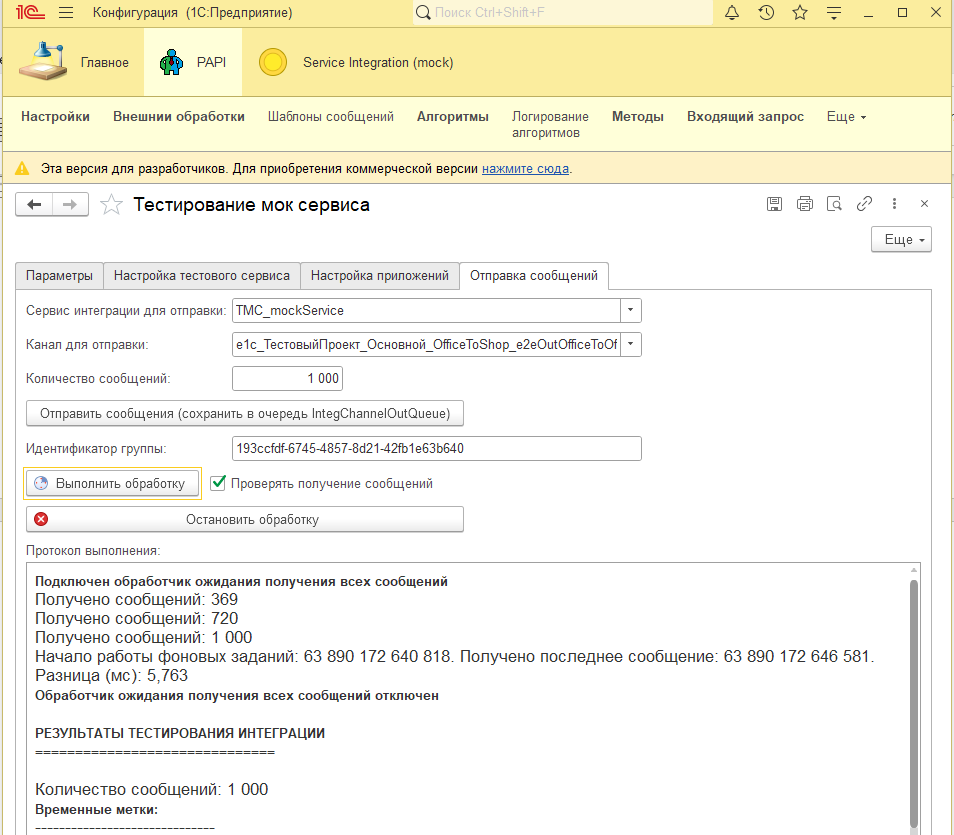
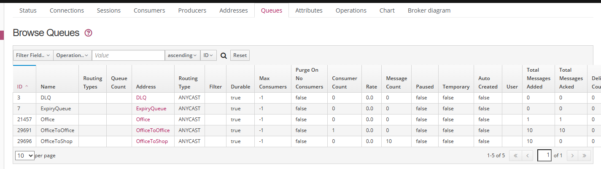
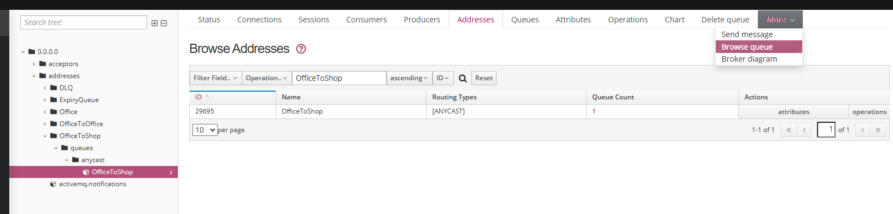
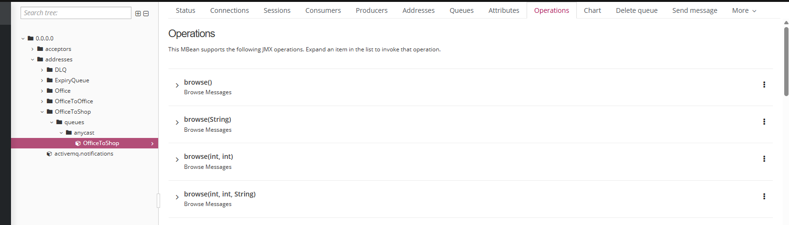
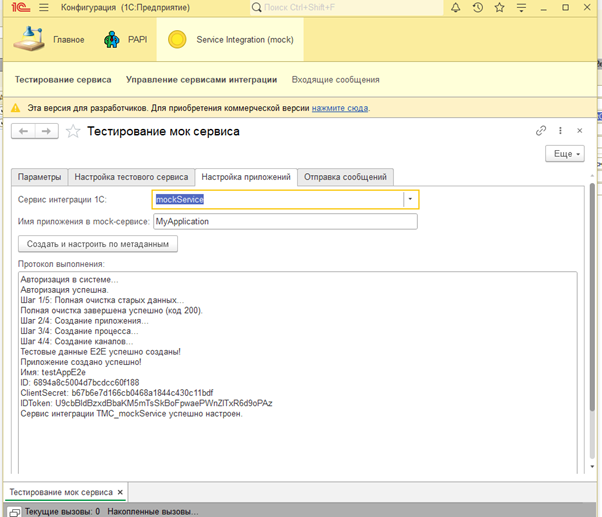

# Integration Service (Mock)

[](https://opensource.org/licenses/MIT)
[](https://github.com/rzateev/1cServiceIntegrationMock)
> [Русская версия](README.md)

> Alternative implementation of integration service for testing. Open-source solution for emulating 1C integration services in local development and testing environment.

## 🎯 Purpose

This project provides a local environment for emulating 1C integration service APIs. The solution allows developers to test and create integration solutions for 1C without the need to access the production "1C-Bus" system.

### 🧩 Complete toolkit: Mock-service + 1C Extension

For end-to-end testing, the project includes an extension for 1C:Enterprise. This allows you to quickly deploy a test environment, configure 1C integration service parameters (application, process, channels) and test the transport layer of integration.

#### **Solution Components:**

*   **Mock-service:** Integration service that emulates external 1C service
*   **Web interface:** Configuration management, testing and monitoring
*   **1C Extension:** Extension for 1C:Enterprise
*   **Functionality:** Forms and methods for testing data sending and receiving
*   **Advantage:** Debug integration logic in development environment without affecting production systems

#### **Technologies:**
**Node.js (Backend) + React (Frontend) + Apache ActiveMQ Artemis (Message Broker)**

> **Technical details:** Detailed information about architecture and implementation technologies is available in the [System Architecture](docs/SystemArchitecture.md) section.

> The extension source code is located in the `[1cServIntTestExt\src]` directory.

**Key capabilities:**
- ✅ **Local development** - Integration environment on local machine
- ✅ **Learning** - Study 1C integration service mechanisms, InboxTable/OutboxTable patterns and AMQP 1.0
- ✅ **Testing** - Local testing of integration code before deployment
- ✅ **Open architecture** - Study implementation of integration patterns
- ✅ **Load testing** - Performance evaluation of integration scenarios

## 🏗️ Architecture

This mock service implements key components required for interaction with external integration service from 1C platform applications:

- **[System Architecture](docs/SystemArchitecture.md)** - Complete system architecture with component relationships.
- **[Message Flow Diagram](docs/MessageFlowDiagram.md)** - Detailed message exchange sequence.

### Main integration components

- **Integration Service API** (Port 9090) - REST API for service configuration and OIDC authentication.
- **Message Broker** (Port 6698) - Apache Artemis with AMQP 1.0 protocol.
- **Management Interface** (Port 3090) - Web interface for configuration and testing.
- **Configuration Storage** (Port 27017) - MongoDB for storing integration service settings.
- **Artemis Web Console** (Port 8161) - UI for broker monitoring and management.
- **Artemis User Management API** (Port 8162) - Extended REST API/UI for Artemis user management.

### Learning areas

- **OIDC Authentication** - 1C authentication in integration services
- **AMQP 1.0 Protocol** - 1C message exchange protocol
- **Service Configuration** - Configuration and management of integration services
- **Message Routing** - Moving messages between services
- **Queue Management** - Principles of message queue operation

## 🚀 Quick Start

### Requirements
- 1C:Enterprise platform not lower than 8.3.17
- Node.js
- Docker & Docker Compose
- Git

### Installation

> **Important:** On Windows, prefer using Git Bash or IDE (VSCode, Cursor, etc.) when executing commands in terminal. Additionally, familiarize yourself with [CROSS_PLATFORM_SETUP.md](docs/CROSS_PLATFORM_SETUP.md).

```bash
# Clone repository
git clone https://github.com/rzateev/1cServiceIntegrationMock.git
cd 1cServiceIntegrationMock

# Configuration
Create .env file based on .env.example.

# Start all services
docker-compose up -d

# Note! When using Mac M1-M4, use the following startup command: DOCKER_DEFAULT_PLATFORM=linux/arm64 docker-compose up -d

# Check status
docker-compose ps
```

### Access points

| Service | URL | Description |
|---|---|---|
| **Frontend Mock Bus** | http://localhost:3090 | Web interface (admin/admin) |
| **Backend API** | http://localhost:9090 | REST API for integration service |
| **Artemis Console** | http://localhost:8161 | Message broker management |
| **Artemis API** | http://localhost:8162 | Extended broker API |
| **MongoDB** | http://localhost:27017 | Configuration database |

## ⚙️ Typical workflow for the provided test application

### Test application setup and configuration verification 
1.  **Environment startup**: After running `docker-compose up -d`, open **Frontend Mock Bus** at `http://localhost:3090`.

    
2.  **Test configuration generation**: Go to **Applications** page and click the `Create test application` button to generate a test suite.
3.  **Test application creation**: The system will create a test application, processes and channels, register them in the database and create users and queues in Artemis.

    

    **Specific test application values:**
    - **Application**: `testAppE2e` with description "Test application for E2E testing". Use as username when configuring integration service in 1C.
    - **ClientSecret**: automatically generated as 16-byte hex token (32 characters, e.g., `68bdf9565056a16f21615505c3cae5a6`)
    - **id_token**: automatically generated as 32-byte base64 token. E.g., `B0fKm9xmQNXZxkBOhkKCYndP2Ng0rV2Y29OYa76lEFUz`
    - **Process**: `e1c::TestProject::Main::OfficeToShop` (mimics 1C structure)
    - **Channels**: 
        - Outbound: `e2eOutOfficeToOffice` with destination `OfficeToOffice` (type `outbound`) — for sending messages to queue that will be automatically processed by consumer
        - Outbound: `e2eOutOfficeToShop` with destination `OfficeToShop` (type `outbound`) — for sending messages to queue without automatic consumption (for viewing in Artemis console)
        - Inbound: `e2eInOfficeToOffice` with destination `OfficeToOffice` (type `inbound`) — for receiving messages from OfficeToOffice queue
  
   **The following operations are performed automatically:**
      - Creating user in Artemis with username and password equal to `id_token`
      - Creating addresses `OfficeToOffice` and `OfficeToShop` with routing type `ANYCAST` (point-to-point)
      - Creating queues `OfficeToOffice` and `OfficeToShop` in corresponding addresses (durable=true)
      - Registration in MongoDB with full hierarchy: Application → Process → Channels
4.  **API connection check**: Use **API Check** page to simulate requests from 1C. Get channel metadata and runtime configuration to verify mock service settings.

    

5.  **Test message sending**: Go to **Channel Testing** page, select test application, select channel, the queue corresponding to the channel in ActiveMQ message broker will be displayed. Fill in message text, perform sending to broker.

    

6.  **Verification and receiving**: Open **Artemis web console** (`http://localhost:8161`), check message delivery to queue (Queues tab). Return to **Channel Testing** and click "Get last message" to read from queue. You should see the message text that you previously sent to the queue. At the same time, the broker console will display message delivery information in the queue.

### Verification using 1C extension
1.  **Extension installation**: Install extension for 1C:Enterprise.
2.  **Test service setup**: 

**Option 1:**
In Enterprise mode, configure integration service through "Integration Service Management" processing. Use `Application Name` as username, `ClientSecret` as password and URLs from frontend. After setup, you can test sending and receiving messages using the extension.


**Option 2:**
Open "Service Testing" processing from extension (section "Service Integration (Mock)")
- The "Parameters" tab will display default parameters corresponding to our test environment. If necessary, you can change URL, logs and password for connecting to integration service backend.

   
- On "Test Service Setup" tab, first click "Create test application (in Mock-service)" button
- Then click "Configure integration service (in 1C)" button

   

3.  **Message sending**: Open "Service Testing" processing from extension (section "Service Integration (Mock)"). On "Message Sending" tab, specify the number of messages to send, specify integration service "TMS_mockService" and channel e2eOfficeToOffice and click "Send messages (save to IntegChannelOutQueue queue)" button. At this moment, messages will be saved to the outgoing message queue in the 1C application database (OutboxTable pattern implementation).

   

Note: you can check using PAPI extension and "Integration Service Messages" processing. Extension package link: https://github.com/dsdred/PAPI

4.  **Running technical scheduled jobs**: Set "Check message receiving" flag. Execute "Run processing" command. At this moment, three technical background jobs managed by 1C platform will be started. Messages from internal IntegChannelOutQueue table with previously generated messages will be sent to Artemis message broker.
To control the correctness of integration flow operation, you can go to Artemis console and check the following entities:
- Connections: you should see two connections corresponding to two background jobs (inbound and outbound message queue processing)

   

- Sessions: also two sessions with different identifiers (similar to Connections)

   
- Producers: you should see one line with producer corresponding to background job that handles message sending to queue

   
- Consumers: you should see one line with consumer corresponding to background job that handles message receiving from queue

   
- Queues: you should see OfficeToOffice and OfficeToShop queues. According to test application configuration, these queues are used for various testing scenarios

   
- Browse Messages: you can view messages in queue if they haven't been received by consumer yet

   

   Message list in OfficeToShop queue

   

   You can also view message content in OfficeToOffice queue

   

   

5.  **Message receiving verification**: Since technical background jobs run in parallel, immediately after sending messages from queue in Artemis message broker, they will be received into technical inbound message queue table IntegChannelInQueue, after successful saving, 1C platform will notify broker about successful message reception.
   During message sending from 1C, we start waiting handler (if "Check message receiving" checkbox is set), which controls message reception from queue and their recording into auxiliary "Incoming Messages" information register, notifies us about receiving all messages from message group and displays statistics on sending and receiving messages.

   Open "Incoming Messages" information register and make sure messages were received.

   Open queue list in Queues section and make sure that messages in OfficeToOffice queue were received by consumer: `Total Messages Added` field values equal `Total Messages Acked`. Messages in OfficeToShop queue will remain for viewing in console

6.  **Connection lifetime verification during background job operation**: After 2 minutes, if you didn't click "Run processing" button again, connections to Artemis message broker should be closed.
You can click "Run processing" button after a minute and make sure connections to Artemis message broker are open.

## ⚙️ Application setup for existing integration service in 1C application and testing

Open "Service Testing" processing from extension (section "Service Integration (Mock)"). On "Application Setup" tab, select existing integration service in your 1C application that you want to test.
Specify application name in mock service that corresponds to integration service in 1C. By default, test application `MyApplication` will be used.
Click "Create and configure by metadata" button and system will automatically create applications, processes and channels in mock service.



Created application parameters can be checked and corrected if necessary (queue names) in mock service frontend at `http://localhost:3090/`.
After that, you can test message sending to this service on "Message Sending" tab.

Note - in this case, separate channels are created for sending and receiving messages according to integration service metadata in 1C.
By default, only message sending to integration service will be available, as queue names for inbound and outbound channels will not match.
After sending, you can use `scripts/office-to-shop-consumer.js` script to check message reception from OfficeToShop queue. For this, you need to copy the script and change queue name in script as it will be named in created application and run it.

## 📚 Documentation

- **[System Architecture](docs/SystemArchitecture.md)** - Complete system architecture
- **[1C Internal Architecture](docs/1cInternalArchitecture.md)** - How 1C:Enterprise works with integration services
- **[Message Flow Diagram](docs/MessageFlowDiagram.md)** - Message exchange process
- **[Cross-platform Setup](docs/CROSS_PLATFORM_SETUP.md)** - Project setup for different platforms

## 🤝 Contributing

1. Fork the repository
2. Create a branch for new functionality
3. Make your changes
4. Send Pull Request

## 📞 Support

For questions related to 1C integration services:
- Create an issue on GitHub
- Check documentation in the `docs/` folder
- Study the "Troubleshooting" section above

---

**Disclaimer**: This project demonstrates 1C integration service patterns for educational purposes. "1C" is a registered trademark of "1C" company. 