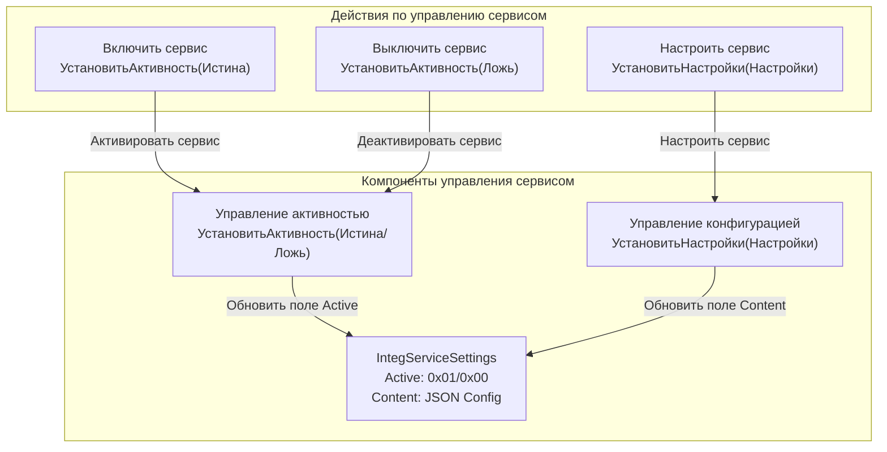
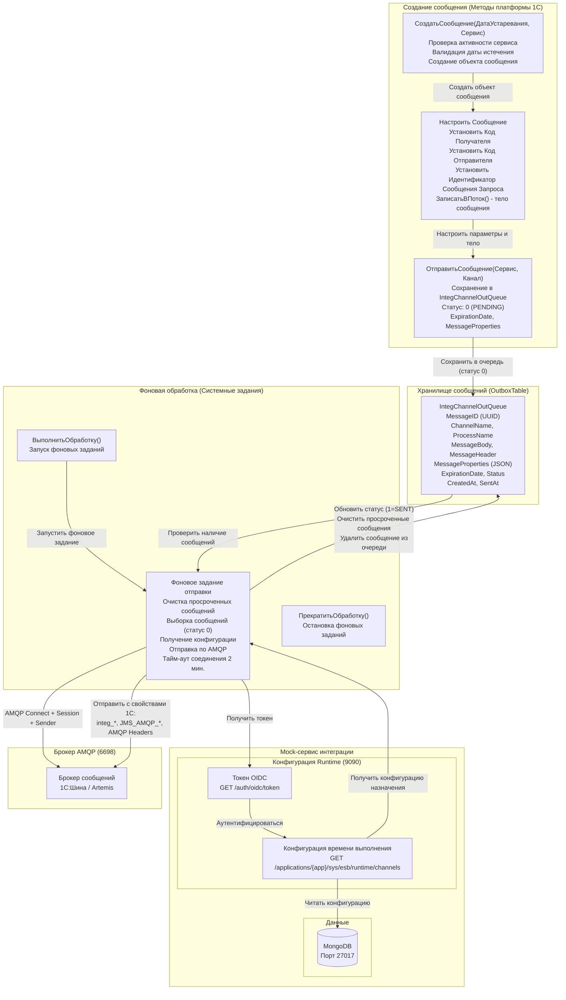
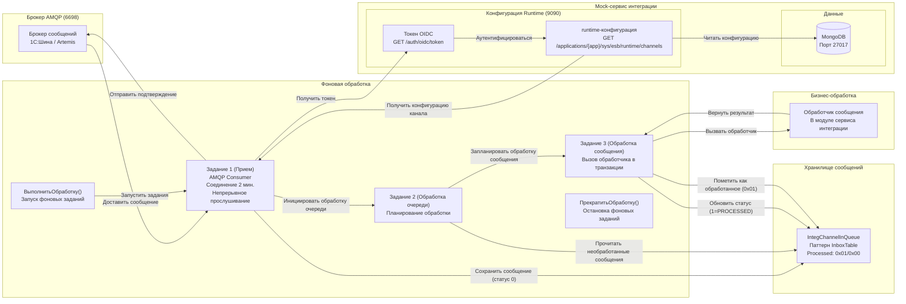
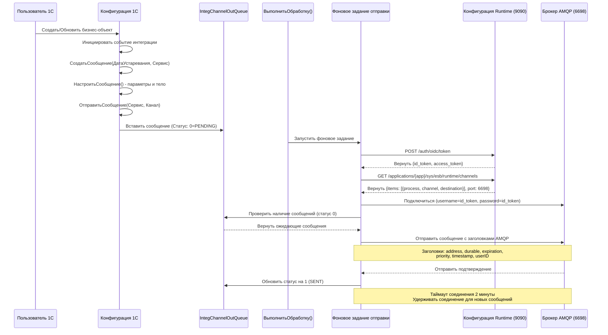
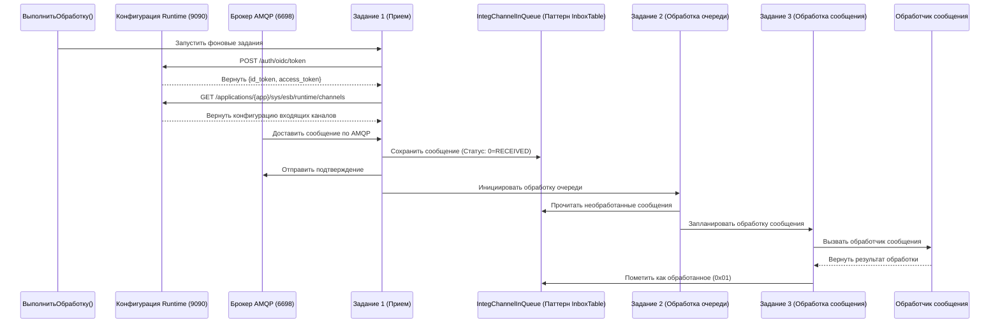

# Внутренняя архитектура сервисов интеграции 1С:Предприятие
> [English Version](1cInternalArchitecture_EN.md)

## Введение для разработчиков, не знакомых с 1С

Для понимания этого документа полезно ознакомиться с несколькими ключевыми концепциями платформы 1С:Предприятие:

*   **"Сервисы интеграции":** Это стандартный, встроенный в платформу 1С механизм для обмена данными с внешними системами на основе сообщений.
*   **"Фоновое задание":** Это эквивалент `cron job` или `background worker` в 1С. Оно используется для выполнения асинхронных или регламентных задач, таких как обработка очередей сообщений.
*   **`СервисыИнтеграции.ВыполнитьОбработку()`:** Это ключевой вызов метода, который запускает цикл обработки сообщений в 1С. Выполнение этого метода активирует системные фоновые задания для отправки и получения сообщений из очередей.

Этот документ предоставляет детальное описание внутренней реализации этих механизмов.

## Обзор

Этот документ описывает внутреннюю архитектуру платформы 1С:Предприятие при работе с сервисами интеграции, основываясь на официальной документации 1С и нашем опыте внедрения. Он охватывает, как 1С создает вспомогательные служебные таблицы, запускает фоновые задания и взаимодействует с внешними сервисами интеграции. Наш проект предоставляет полную mock-реализацию этих внешних сервисов для обеспечения локальной разработки и тестирования.

## Внутренние компоненты платформы 1С

### Создание служебных таблиц (реализация паттерна InboxTable/OutboxTable)

Когда в 1С создается сервис интеграции, платформа автоматически генерирует несколько вспомогательных таблиц, которые реализуют паттерн **InboxTable/OutboxTable** для гарантированной доставки сообщений:

**Ключевые преимущества паттерна:**
- **Гарантированная доставка**: Сообщения хранятся в таблицах базы данных до успешной обработки.
- **Отказоустойчивость**: Система может восстанавливаться после сбоев и повторять обработку сообщений.
- **Транзакционная безопасность**: Сообщения удаляются только после успешной доставки/обработки.
- **Аудит**: Сохраняется полная история обработки сообщений.

#### 1. **IntegServiceSettings** - Настройки сервиса
```sql
-- Основная таблица настроек сервиса (реализация паттерна InboxTable/OutboxTable)
CREATE TABLE IntegServiceSettings (
    ServiceName VARCHAR(255),           -- Имя сервиса
    ServiceURL VARCHAR(500),            -- URL внешнего сервиса
    ClientID VARCHAR(255),              -- Идентификатор клиента OIDC
    ClientSecret VARCHAR(255),          -- Секрет клиента OIDC
    TokenEndpoint VARCHAR(500),         -- Эндпоинт для получения токена OIDC
    MetadataEndpoint VARCHAR(500),      -- Эндпоинт метаданных каналов
    RuntimeEndpoint VARCHAR(500),       -- Эндпоинт runtime-конфигурации каналов
    Active BINARY(1) DEFAULT 0x00,      -- Флаг активности сервиса (0x01=активен, 0x00=неактивен)
    Content TEXT,                       -- Содержимое настроек сервиса (JSON)
    CreatedAt DATETIME,
    UpdatedAt DATETIME
);
```

#### 2. **IntegChannelOutQueue** - Очередь исходящих сообщений (паттерн OutboxTable)
```sql
-- Хранилище исходящих сообщений (паттерн OutboxTable для гарантированной доставки)
CREATE TABLE IntegChannelOutQueue (
    MessageID VARCHAR(36),              -- UUID идентификатор сообщения
    ChannelName VARCHAR(255),           -- Имя канала
    ProcessName VARCHAR(255),           -- Имя процесса
    MessageBody TEXT,                   -- Содержимое сообщения (JSON)
    MessageHeader TEXT,                 -- Заголовки сообщения (JSON)
    MessageProperties TEXT,             -- Свойства 1С (JSON)
    ExpirationDate DATETIME,            -- Дата истечения срока действия сообщения (UTC)
    Status INT DEFAULT 0,                -- 0=PENDING, 1=SENT, 2=DELIVERED, 3=ERROR
    CreatedAt DATETIME,
    SentAt DATETIME,
    DeliveredAt DATETIME,
    ErrorMessage TEXT,
    RetryCount INT DEFAULT 0
);
```

#### 3. **IntegChannelInQueue** - Очередь входящих сообщений (паттерн InboxTable)
```sql
-- Хранилище входящих сообщений (паттерн InboxTable для гарантированной обработки)
CREATE TABLE IntegChannelInQueue (
    MessageID VARCHAR(36),              -- UUID идентификатор сообщения
    ChannelName VARCHAR(255),           -- Имя канала
    ProcessName VARCHAR(255),           -- Имя процесса
    MessageBody TEXT,                   -- Содержимое сообщения (JSON)
    MessageHeader TEXT,                 -- Заголовки сообщения (JSON)
    MessageProperties TEXT,             -- Свойства 1С (JSON)
    Status INT DEFAULT 0,                -- 0=RECEIVED, 1=PROCESSED, 2=ERROR
    Processed BINARY(1) DEFAULT 0x00,    -- Флаг обработки (0x01=обработано, 0x00=не обработано)
    ReceivedAt DATETIME,
    ProcessedAt DATETIME,
    ErrorMessage TEXT
);
```

#### 4. **IntegChannelMetadata** - Конфигурация канала
```sql
-- Метаданные канала от внешнего сервиса
CREATE TABLE IntegChannelMetadata (
    ChannelName VARCHAR(255),           -- Имя канала
    ProcessName VARCHAR(255),           -- Имя процесса
    Direction VARCHAR(50),              -- INBOUND, OUTBOUND, BIDIRECTIONAL
    Destination VARCHAR(255),           -- Адрес назначения (очередь)
    Access VARCHAR(50),                 -- READ_ONLY, WRITE_ONLY, READ_WRITE
    Description TEXT,
    LastUpdated DATETIME
);
```

### Архитектура фоновых заданий

Платформа 1С использует комбинацию регламентных и системных фоновых заданий для операций интеграции:

#### Системные фоновые задания (управляются платформой)

Это **системные фоновые задания**, которые автоматически управляются платформой 1С при вызове `СервисыИнтеграции.ВыполнитьОбработку()`:

##### 1. **Отправщик исходящих сообщений** (Системное фоновое задание)

**Назначение**: Обрабатывает и отправляет исходящие интеграционные сообщения из 1С во внешние системы.

**Схема выполнения**:
- **Системное фоновое задание**: Автоматически запускается платформой при вызове `ВыполнитьОбработку()`.
- **Триггер**: Вызов метода `СервисыИнтеграции.ВыполнитьОбработку()`.
- **Длительность**: Работает до тех пор, пока все ожидающие сообщения не будут обработаны, затем останавливается.
- **Перезапуск**: Автоматически перезапускается при следующем вызове `ВыполнитьОбработку()`.

**Рабочий процесс**:
1.  **Очистка просроченных сообщений**: Удаляет сообщения из `IntegChannelOutQueue`, где `ExpirationDate < CurrentDate`.
2.  **Выборка сообщений**: Запрашивает из таблицы `IntegChannelOutQueue` сообщения со статусом `0` (PENDING).
3.  **Получение runtime-конфигурации каналов**:
    - **Аутентификация OIDC**: `POST /auth/oidc/token` (Порт 9090) для получения токена доступа.
    - **Данные конфигурации**: `GET /applications/{app}/sys/esb/runtime/channels` (Порт 9090) для получения очередей назначения.
4.  **Обмен по AMQP**:
    - **Соединение**: Фоновое задание устанавливает соединение AMQP 1.0 с брокером (Порт 6698), используя учетные данные из токена.
    - **Сессия**: Создает сессию AMQP для передачи сообщений.
    - **Producer**: Создает AMQP producer для отправки сообщений в очередь назначения.
    - **Передача сообщения**: Отправляет сообщение в очередь назначения из конфигурации времени выполнения.
5.  **Обновление статуса**: Обновляет статус сообщения на `1` (SENT) в случае успеха или `3` (ERROR) в случае сбоя.
6.  **Удаление из очереди**: Удаляет отправленное сообщение из `IntegChannelOutQueue` (паттерн OutboxTable).


##### 2. **Обработка входящих сообщений** (Три системных фоновых задания)

**Назначение**: Получает и обрабатывает входящие сообщения из внешних систем в 1С.

**Схема выполнения**:
- **Три системных фоновых задания**: Автоматически запускаются платформой при вызове `ВыполнитьОбработку()`.
- **Триггер**: Вызов метода `СервисыИнтеграции.ВыполнитьОбработку()`.
- **Длительность соединения**: Сетевое соединение поддерживается в течение 2 минут после каждого вызова `ВыполнитьОбработку()`.
- **Перезапуск**: Автоматически перезапускаются при следующем вызове `ВыполнитьОбработку()`.

**Три фоновых задания для входящей обработки**:

1.  **Задание приема сообщений**:
    -   Получает сообщения от внешнего сервиса интеграции.
    -   Помещает сообщения в локальную очередь.
    -   Уведомляет внешний сервис об успешном приеме.

2.  **Задание обработки очереди**:
    -   Анализирует очередь сообщений.
    -   Определяет параметры обработки (пользователь, область данных).
    -   Запускает индивидуальные задания обработки сообщений.

3.  **Задание индивидуальной обработки сообщения**:
    -   Обрабатывает конкретное сообщение.
    -   Вызывает обработчик сообщения в модуле сервиса интеграции.
    -   Помечает сообщение как обработанное или повторяет при сбое.

**Рабочий процесс**:
1.  **Получение конфигурации времени выполнения**:
    - **Аутентификация OIDC**: `POST /auth/oidc/token` (Порт 9090) для получения токена доступа.
    - **Конфигурация времени выполнения**: `GET /applications/{app}/sys/esb/runtime/channels` (Порт 9090) для получения конфигурации входящих каналов.
2.  **Обмен по AMQP**:
    - **Соединение**: Задание 1 устанавливает соединение AMQP 1.0 с брокером (Порт 6698), используя учетные данные из токена.
    - **Consumer**: Создает AMQP consumer для получения сообщений из настроенных входящих очередей.
    - **Прием сообщений**: Обрабатывает входящие сообщения из подписанных очередей.
3.  **Прием сообщения (Задание 1)**:
    - **Установка соединения**: Создает соединение AMQP 1.0 с брокером (Порт 6698).
    - **Непрерывное прослушивание**: Consumer непрерывно слушает входящие сообщения (тайм-аут соединения 2 минуты).
    - **Получение сообщения**: Получает сообщение от внешнего сервиса по AMQP.
    - **Сохранение сообщения**: Сохраняет сообщение в таблицу `IntegChannelInQueue` со статусом `0` (RECEIVED).
    - **Немедленное подтверждение**: Сразу отправляет подтверждение внешнему сервису об успешном приеме сообщения.
    - **Продолжение прослушивания**: Consumer продолжает слушать следующие сообщения (не завершается после одного сообщения).
    - **Поддержание соединения**: Соединение удерживается 2 минуты или до следующего вызова `ВыполнитьОбработку()`.
4.  **Обработка очереди (Задание 2)**:
    - **Чтение очереди**: Читает необработанные сообщения из `IntegChannelInQueue`, где `Processed = 0x00`.
    - **Планирование обработки**: Для каждого сообщения определяет параметры обработки (пользователь, область данных).
    - **Планирование задания**: Планирует Задание 3 для каждого сообщения с конкретными параметрами.
    - **Самопланирование**: Если остаются необработанные сообщения, планирует свой собственный перезапуск.
5.  **Обработка сообщения (Задание 3)**:
    - **Вызов обработчика**: Вызывает обработчик сообщения в модуле сервиса интеграции.
    - **Транзакция**: Всегда выполняется в транзакции (независимо от флага "В транзакции").
    - **Успех**: Помечает сообщение как обработанное (`Processed = 0x01`), устанавливает статус `1` (PROCESSED), очищает поля `MessageHeader = NULL`, `MessageBody = NULL` и коммитит транзакцию.
    - **Сбой**: Откатывает транзакцию, и сообщение остается для повторной попытки.
6.  **Бизнес-логика**: Обработчик сообщения выполняет бизнес-логику в модуле сервиса интеграции.

**Обработка ошибок**: Изолирует ошибки обработки сообщений для предотвращения прерывания работы сервиса.

**Ключевые различия паттернов InboxTable/OutboxTable**:
- **OutboxTable** (`IntegChannelOutQueue`): Сообщения полностью удаляются из очереди после успешной отправки
- **InboxTable** (`IntegChannelInQueue`): Сообщения остаются в очереди, но поля `MessageHeader` и `MessageBody` очищаются (NULL), а статус `Processed` устанавливается в `0x01`. Предположение, что это позволяет избежать повторной обработки сообщения (паттерн Idempotency)

#### Регламентное фоновое задание

##### **Контроллер обработки интеграции** (Регламентное фоновое задание)

**Назначение**: Это **регламентное фоновое задание**, которое **разработчик должен создать вручную** и настроить расписание для регулярного вызова `СервисыИнтеграции.ВыполнитьОбработку()` для поддержания процесса интеграции.

**Схема выполнения**:
- **Регламентное задание**: Разработчик создает вручную и настраивает расписание (рекомендуется: каждые 1-5 минут).
- **Длительность**: Короткое время выполнения - просто вызывает `ВыполнитьОбработку()`.
- **Функция**: Вызывает `СервисыИнтеграции.ВыполнитьОбработку()` для активации системных фоновых заданий интеграции.

**Рабочий процесс**:
1.  **Вызов метода**: Вызывает `СервисыИнтеграции.ВыполнитьОбработку()`.
2.  **Поддержание соединения**: Поддерживает сетевое соединение с внешним сервисом интеграции в течение 2 минут.
3.  **Активация фоновых заданий**: Активирует системные фоновые задания для обработки сообщений.
4.  **Автоматическое управление**: Платформа автоматически управляет жизненным циклом фоновых заданий.

**Важные примечания**:
- **Тайм-аут соединения**: Сетевое соединение закрывается после 2 минут бездействия.
- **Рекомендуемая частота**: Вызывать `ВыполнитьОбработку()` каждые 1-5 минут через регламентное задание.
- **Ручное создание**: Разработчик должен создать регламентное задание вручную и настроить расписание.
- **Автоматическое управление**: Платформа автоматически запускает/останавливает системные фоновые задания по мере необходимости.

## Внутренняя архитектура платформы

### Архитектура управления сервисами

#### Диаграмма управления сервисами



### Архитектура обработки исходящих сообщений



### Архитектура обработки входящих сообщений



### Ключевые внутренние процессы

#### 1. **Управление активностью сервиса**
- **Включить сервис**: `УстановитьАктивность(Истина)` → Проверить, есть ли запись в `IntegServiceSettings` → Установить `Active = 0x01`.
- **Выключить сервис**: `УстановитьАктивность(Ложь)` → Проверить поле `Content` → Установить `Active = 0x00` или удалить запись, если `Content = NULL`.

#### 2. **Управление конфигурацией сервиса**
- **Настроить сервис**: `УстановитьНастройки(Настройки)` → Создать запись, если не существует → Заполнить поле `Content` конфигурацией.

#### 3. **Процесс создания сообщения**
- **Создать сообщение**: `СоздатьСообщение(ДатаУстаревания, Сервис)` → Проверить активность сервиса → Проверить дату истечения → Создать объект сообщения.
- **Настроить сообщение**: Установить параметры сообщения (получатели, отправитель, ID запроса, тело, размер, описание, тип).
- **Отправить сообщение**: `ОтправитьСообщение(Сервис, Канал)` → Сохранить сообщение в `IntegChannelOutQueue` со статусом `PENDING`.

#### 4. **Управление фоновой обработкой**
- **Начать обработку**: `ВыполнитьОбработку()` → Активировать системные фоновые задания → Поддерживать соединение AMQP в течение 2 минут.
- **Прекратить обработку**: `ПрекратитьОбработку()` → Завершить фоновые задания → Закрыть соединения.

## Поток сообщений в платформе 1С

### Обработка исходящих сообщений



### Обработка входящих сообщений



## Свойства 1С и заголовки сообщений

### Стандартные свойства сообщений 1С

Платформа 1С автоматически добавляет эти свойства ко всем интеграционным сообщениям, когда они отправляются в брокер AMQP (могут варьироваться в зависимости от версии платформы). При этом не все свойства можно прочитать при обработке входящих сообщений

#### **Свойства интеграции**

| Свойство | Описание | Пример значения |
|---|---|---|
| `integ_message_id` | Уникальный идентификатор сообщения | `090eb127-516e-4d2a-8571-06fab7da6f63` |
| `integ_message_correlation_id` | ID корреляции для связывания сообщений | `e92c290f-0001-40fc-ba80-830d84c8a436` |
| `integ_message_body_size` | Размер тела сообщения в байтах | `56` |
| `integ_sender_code` | Код приложения-отправителя | `MainOffice` |

#### **Свойства JMS AMQP**

| Свойство | Описание | Пример значения |
|---|---|---|
| `JMS_AMQP_HEADER` | Включить заголовки AMQP | `true` |
| `JMS_AMQP_HEADERDURABLE` | Сделать заголовки персистентными | `true` |
| `JMS_AMQP_ORIGINAL_ENCODING` | Формат кодировки сообщения | `6` |
| `JMSCorrelationID` | ID корреляции JMS в формате AMQP UUID | `ID:AMQP_UUID:e92c290f-0001-40fc-ba80-830d84c8a436` |
| `NATIVE_MESSAGE_ID` | Нативный ID сообщения AMQP в формате UUID | `ID:AMQP_UUID:090eb127-516e-4d2a-8571-06fab7da6f63` |

#### **Заголовки сообщений AMQP**

| Свойство | Описание | Пример значения |
|---|---|---|
| `address` | Адрес назначения (очередь) | `Office` |
| `durable` | Флаг персистентности сообщения | `true` |
| `expiration` | Временная метка истечения срока действия | `1755719423000` |
| `largeMessage` | Флаг большого сообщения | `false` |
| `messageID` | Последовательный ID сообщения | `22815` |
| `persistentSize` | Размер персистентного сообщения в байтах | `1202` |
| `priority` | Приоритет сообщения | `4` |
| `redelivered` | Флаг повторной доставки | `false` |
| `selected` | Флаг выборки сообщения | `true` |
| `timestamp` | Временная метка создания сообщения | `1753991423000` |
| `type` | Идентификатор типа сообщения | `4` |
| `userID` | Идентификатор пользователя в формате UUID | `ID:090eb127-516e-4d2a-8571-06fab7da6f63` |

#### **Бизнес-свойства**

| Свойство | Описание | Пример значения |
|---|---|---|
| `SenderCode` | Код приложения-отправителя | `MainOffice` |
| `ДатаОтправки` | Дата и время отправки сообщения | `31.07.2025 22:50:23` |
| `Описание` | Текстовое описание сообщения | `Тестовое сообщение №1` |
| `РазмерСообщения` | Размер сообщения в байтах | `56` |
| `ТипСообщения` | Классификация типа сообщения | `Тестовое` |

### Кастомные свойства сообщений

Примечание: можно добавлять свои свойства в сообщение и они будут доставлены до получателя.

### Управление фоновыми заданиями

Платформа 1С автоматически управляет обработкой интеграции:

**Регламентное фоновое задание**:
- **Контроллер обработки интеграции**: Разработчик создает вручную и настраивает расписание (рекомендуется: каждые 1-5 минут).
- **Назначение**: Вызывает `СервисыИнтеграции.ВыполнитьОбработку()` для активации системных фоновых заданий интеграции.
- **Ручное создание**: Разработчик должен создать регламентное задание вручную при настройке сервисов интеграции.
- **Настройка расписания**: Расписание настраивается разработчиком в зависимости от требований интеграции.

**Системные фоновые задания**:
- **Автоматическая активация**: Запускаются платформой при вызове `ВыполнитьОбработку()`.
- **Управление соединением**: Поддерживают сетевое соединение в течение 2 минут после каждого вызова.
- **Автоматический жизненный цикл**: Платформа автоматически запускает/останавливает системные фоновые задания по мере необходимости.
- **Нет ручного управления**: Это системные задания, а не задания, настраиваемые пользователем.

## Ключевые возможности платформы 1С в области интеграции

### Автоматическое создание таблиц

Когда в 1С настраивается сервис интеграции, платформа автоматически создает необходимые вспомогательные таблицы в базе данных. Это происходит прозрачно в процессе настройки и не требует ручной работы с базой данных.

### Интеграция с фоновыми заданиями

Платформа 1С интегрирует фоновые задания непосредственно в рабочий процесс интеграции:
- **Регламентное задание**: Разработчик создает вручную для вызова `ВыполнитьОбработку()` с нужной частотой (рекомендуется: каждые 1-5 минут).
- **Системные задания**: Автоматически активируются платформой при вызове `ВыполнитьОбработку()`.
- **Управление соединением**: Поддерживает сетевые соединения с брокером AMQP в течение 2 минут после каждого вызова.
- **Восстановление после ошибок**: Встроенные механизмы повторных попыток обрабатывают временные сбои.
- **Отслеживание статуса**: Статус сообщения автоматически обновляется на протяжении всего жизненного цикла обработки.

### Реализация паттерна InboxTable/OutboxTable

Платформа 1С реализует паттерн **InboxTable/OutboxTable** для гарантированной доставки сообщений:

#### **Паттерн OutboxTable** (`IntegChannelOutQueue`)
- **Назначение**: Гарантирует, что исходящие сообщения будут доставлены внешним сервисам интеграции.
- **Процесс**:
  1. Сообщение создается и сохраняется в `IntegChannelOutQueue` со статусом `0` (PENDING).
  2. Фоновое задание забирает ожидающие сообщения.
  3. Сообщение отправляется во внешний сервис по AMQP.
  4. Сообщение удаляется из очереди только после успешного подтверждения доставки.
  5. Неудачные сообщения остаются в очереди для повторных попыток.

#### **Паттерн InboxTable** (`IntegChannelInQueue`)
- **Назначение**: Гарантирует, что входящие сообщения будут обработаны бизнес-логикой 1С.
- **Процесс**:
  1. Сообщение получается от внешнего сервиса и сохраняется в `IntegChannelInQueue`.
  2. Фоновое задание обрабатывает сообщения со статусом `0` (RECEIVED) и `Processed = 0x00`.
  3. Бизнес-логика выполняется в транзакции.
  4. Сообщение помечается как обработанное (`Processed = 0x01`, статус `1` (PROCESSED), содержимое очищается).
  5. Сбой обработки позволяет сообщению остаться для повторной попытки.

#### **Ключевые преимущества паттерна**
- **Гарантированная доставка**: Сообщения сохраняются в базе данных до успешной обработки.
- **Отказоустойчивость**: Система может восстанавливаться после сбоев и повторять обработку.
- **Транзакционная безопасность**: Сообщения удаляются только после успешного завершения.
- **Аудит**: Сохраняется полная история обработки сообщений.
- **Идемпотентность**: Сообщения можно безопасно обрабатывать повторно без дублирования.

### Детали процесса создания сообщения

#### **Пошаговое создание сообщения**

1.  **Создание сообщения** (`СоздатьСообщение`)
    -   **Входные параметры**: `ДатаУстаревания`, `Сервис`.
    -   **Проверка**: Проверить активность сервиса, валидность даты истечения.
    -   **Результат**: Создать объект сообщения с базовой структурой.

2.  **Настройка сообщения** (Установка параметров и тела)
    -   **Получатели**: Установить `КодПолучателя`.
    -   **Отправитель**: Установить `КодОтправителя`.
    -   **ID запроса**: Сгенерировать `ИдентификаторСообщенияЗапроса` (уникальный UUID).
    -   **Тело сообщения**: Записать содержимое в поток сообщения.
    -   **Параметры**: Установить `РазмерСообщения`, `ДатаОтправки`, `Описание`, `ТипСообщения`.

3.  **Отправка сообщения** (`ОтправитьСообщение`)
    -   **Входные параметры**: `Сервис`, `Канал`.
    -   **Хранение**: Сохранить сообщение в `IntegChannelOutQueue` со статусом `PENDING`.
    -   **Очередь**: Сообщение попадает в очередь по паттерну OutboxTable для гарантированной доставки.

#### **Детали системной архитектуры**

**Управление фоновыми заданиями**:
- **ВыполнитьОбработку()**: `Запуск фоновых заданий` - инициирует цикл фоновой обработки.
- **ПрекратитьОбработку()**: `Остановка фоновых заданий` - корректно завершает фоновые задания.

**Внешняя интеграция**:
- **Брокер AMQP (Порт 6698)**: Прямое подключение к сервису брокера сообщений.
- **Сервис брокера**: Брокер сообщений 1С:Шина / Artemis.
- **Детали подключения**: Протокол AMQP 1.0 по порту 6698.

**Конфигурация времени выполнения**:
- **Конфигурация Runtime (Порт 9090)**: Сервис конфигурации для динамического управления каналами.
- **Токен OIDC**: Аутентификация через `POST /auth/oidc/token`.
- **Конфигурация времени выполнения**: Конфигурация каналов через `GET /applications/{app}/sys/esb/runtime/channels`.
- **Детали сервиса**: REST API на порту 9090 для управления конфигурацией.

### Структура свойств сообщения

#### **Категории свойств в интеграции 1С**

1.  **Свойства интеграции** (`integ_*`) - Основные свойства интеграционного сообщения.
2.  **Свойства JMS AMQP** (`JMS_*`, `NATIVE_*`) - Свойства протокола JMS AMQP.
3.  **Заголовки сообщений AMQP** - Заголовки протокола AMQP для маршрутизации и доставки.
4.  **Бизнес-свойства** - Пользовательские свойства, специфичные для бизнес-логики.


#### **Хранение свойств в таблицах очередей**

- **Поле MessageProperties**: Все свойства хранятся в формате JSON в поле `MessageProperties`.
- **Поле MessageHeader**: Специфичные для AMQP заголовки хранятся отдельно в `MessageHeader`.
- **Поле MessageBody**: Фактическое содержимое сообщения хранится в `MessageBody`.
- **Сериализация свойств**: Свойства автоматически сериализуются в формат JSON для хранения.

## Ссылки

- [Поинтегрируем: сервисы интеграции – новый стандарт или просто коннектор?](https://infostart.ru/1c/articles/2042916/) - Официальная документация по сервисам интеграции 1С.
- [1C:ESB Official Documentation](https://1cmycloud.com/console/help/esb/) - Документация по 1С:Шине.
- [System Architecture](../SystemArchitecture.md) - Архитектура нашей платформы.
- [Message Flow Diagram](../MessageFlowDiagram.md) - Процесс обмена сообщениями.
