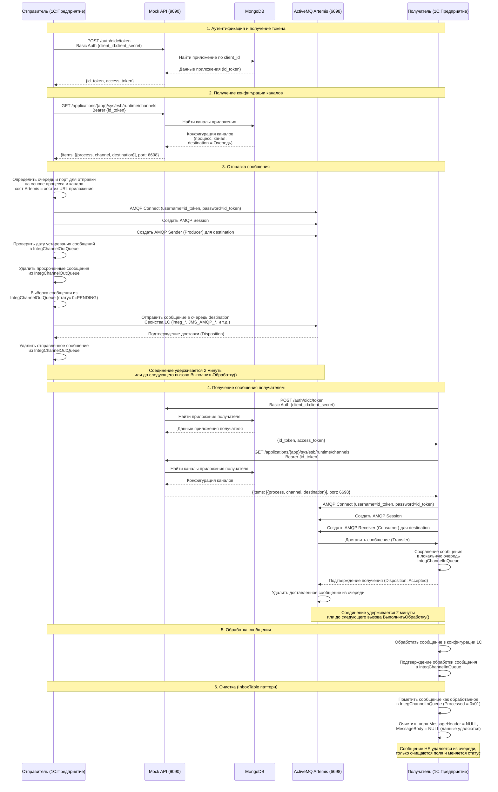

# Диаграмма потоков сообщений при использовании сервисов интеграции 1С и Mock-сервиса интеграции
> [English Version](MessageFlowDiagram_EN.md)

## Описание процесса

Эта диаграмма показывает процесс обмена сообщениями между приложением на платформе 1С:Предприятие и внешним mock-сервисом интеграции, предоставляемым этой платформой. Она иллюстрирует, как клиент (1С) проходит аутентификацию, получает конфигурацию и обменивается сообщениями с сервисом.

## Диаграмма последовательности

Процесс обмена сообщениями состоит из следующих основных шагов:

1.  **Аутентификация**: Техническое фоновое задание 1С:Предприятие (Отправитель или Получатель) аутентифицируется в Mock API, используя свой `client_id` (= имя приложения) и `client_secret`  для получения `id_token`.
2.  **Получение конфигурации**: Клиент использует `id_token` для запроса конфигурации своих каналов, которая включает destination (имя очереди в брокере сообщений) и порт брокера сообщений.
3.  **Отправка сообщения**: Отправитель подключается к брокеру ActiveMQ Artemis, создает AMQP Session и Sender, используя `id_token` в качестве учетных данных. Перед отправкой проверяется дата устаревания сообщений в `IntegChannelOutQueue` - просроченные сообщения удаляются. Отправленные сообщения также удаляются из `IntegChannelOutQueue` (паттерн OutboxTable). Соединение удерживается в течение 2 минут или до следующего вызова `СервисыИнтеграции.ВыполнитьОбработку()`.
4.  **Получение сообщения**: Получатель подключается к брокеру, создает AMQP Session и Receiver, подписывается на свою назначенную очередь и получает сообщение по протоколу AMQP 1.0. После подтверждения получения (Disposition: Accepted) сообщение автоматически удаляется из очереди брокера. Соединение удерживается в течение 2 минут или до следующего вызова `СервисыИнтеграции.ВыполнитьОбработку()`.
5.  **Обработка**: Получатель обрабатывает сообщение в соответствии со своей внутренней бизнес-логикой.
6.  **Очистка**: После успешной обработки сообщение помечается как обработанное в `IntegChannelInQueue` (Processed = 0x01), поля MessageHeader и MessageBody очищаются (NULL), но запись в очереди НЕ удаляется (паттерн InboxTable).

