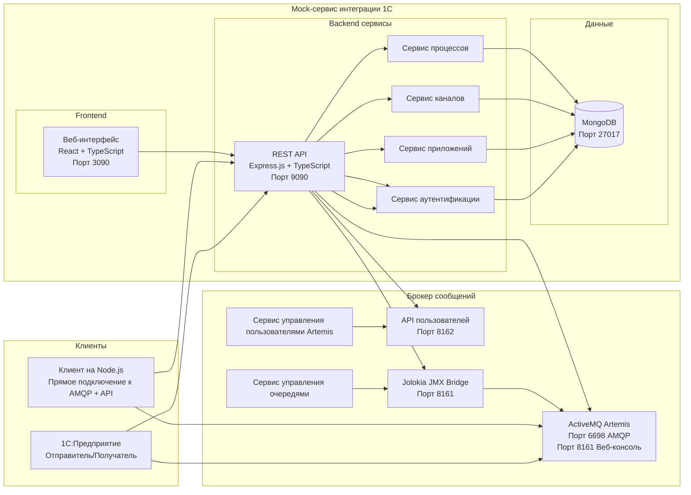
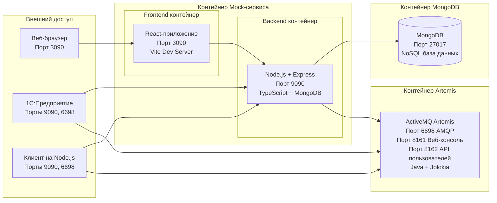

# Архитектура системы для платформы интеграции с сервисами 1С
> [English Version](SystemArchitecture_EN.md)

## Общая архитектура



## Архитектура docker-контейнеров



## Технологический стек

Эта платформа эмулирует внешний сервис интеграции, используя технологии, полностью совместимые с продуктивным окружением 1С:

### Backend
- **Node.js** - Среда выполнения
- **Express.js** - Веб-фреймворк для REST API
- **TypeScript** - Типизированный JavaScript для надежности
- **Mongoose** - ODM для MongoDB
- **JWT** - Токены для аутентификации (OIDC)

### Frontend
- **React** - UI-библиотека для интерфейса управления
- **TypeScript** - Типизированный JavaScript
- **Ant Design** - UI-компоненты
- **Axios** - HTTP-клиент
- **Vite** - Инструмент сборки

### Брокер сообщений
- **ActiveMQ Artemis** - Брокер сообщений (аналогичный используемому в 1С:Шине)
- **AMQP 1.0** - Протокол обмена сообщениями (индустриальный стандарт)
- **Jolokia** - JMX-HTTP мост для управления

### База данных
- **MongoDB** - NoSQL база данных для хранения конфигураций
- **Docker** - Контейнеризация для легкого развертывания

### DevOps
- **Docker Compose** - Оркестрация контейнеров
- **Shell Scripts** - Автоматизация
- **Git** - Контроль версий

## Структура данных

### Модель "Приложение" (Application)
```typescript
{
  name: string,           // Имя приложения = ClientId = Имя пользователя в настройках внешнего сервиса в конфигураторе 1С
  description: string,    // Описание
  clientSecret: string,   // Секрет для OIDC = Пароль в настройках внешнего сервиса в конфигураторе 1С
  id_token: string,       // Учетные данные для AMQP: id_token используется как имя пользователя и пароль в AMQP 1.0
  createdAt: Date,        // Дата создания
  updatedAt: Date         // Дата обновления
}
```

### Модель "Процесс" (Process)
```typescript
{
  name: string,           // Имя процесса
  description: string,    // Описание
  applicationId: ObjectId, // Ссылка на приложение
  createdAt: Date,        // Дата создания
  updatedAt: Date         // Дата обновления
}
```

### Модель "Канал" (Channel)
```typescript
{
  name: string,           // Имя канала = Имя канала в конфигураторе 1С
  description: string,    // Описание
  destination: string,    // Адрес назначения = Имя очереди для подключения фоновых заданий 1С
  processId: ObjectId,    // Ссылка на процесс
  direction: 'inbound' | 'outbound', // Направление канала
  createdAt: Date,        // Дата создания
  updatedAt: Date         // Дата обновления
}
```

### Модель "Пользователь" (User)
```typescript
{
  username: string,       // Имя администратора для веб-интерфейса
  password: string,       // Хешированный пароль
  roles: string[],        // Роли пользователя (по умолчанию: ['admin'])
  isActive: boolean,      // Статус аккаунта
  createdAt: Date         // Дата создания
}
```

## Реализованная функциональность

### Компоненты Frontend

#### Основные страницы управления
- **Управление приложениями** - Полные CRUD-операции для приложений с учетными данными OIDC.
- **Управление процессами** - Организация и управление бизнес-процессами.
- **Управление каналами** - Конфигурация каналов AMQP с управлением очередями.
- **Управление пользователями** - Администрирование системных пользователей с доступом на основе ролей.

#### Тестирование и интеграция
- **Страница интеграционного тестирования** - Тестирование сообщений AMQP с пользовательскими свойствами 1С.
- **Страница тестирования API** - Валидация и тестирование эндпоинтов REST API.
- **Генератор E2E тестовых данных** - Автоматизированное создание тестовых приложений, процессов и каналов.

#### Возможности UI
- **Интеграция с буфером обмена** - Копирование учетных данных и URL в один клик.
- **Валидация в реальном времени** - Валидация форм с обработкой ошибок.
- **Адаптивный дизайн** - Компоненты Ant Design с поддержкой мобильных устройств.

### Сервисы Backend

#### Система авто-конфигурации
```typescript
// Автоматическая настройка при старте
await ArtemisConfiguratorService.configure();
```
- **Авто-создание пользователей** - Создает пользователей Artemis из id_token'ов приложений.
- **Авто-создание очередей** - Создает очереди AMQP для всех настроенных каналов.
- **Проверка существования** - Предотвращает дублирование пользователей/очередей.
- **Синхронизация при старте** - Гарантирует, что конфигурация в MongoDB соответствует состоянию Artemis.

#### Безопасное каскадное удаление
```typescript
// Каскадное удаление приложения с проверкой сообщений
const report = await ApplicationCascadeDeleteService.delete(applicationId);
```
- **Проверка количества сообщений** - Блокирует удаление, если очереди содержат сообщения.
- **HTTP 409 Conflict** - Возвращает корректные статусы для заблокированных операций.
- **Опция принудительного удаления** - Обход проверок для административных операций.
- **Каскадная очистка** - Удаляет связанные процессы, каналы и пользователей Artemis.

#### Управление каналами
- **Переименование очередей** - Автоматическое пересоздание очереди при изменении адреса назначения канала.
- **Проверка сообщений** - Предотвращает удаление канала с активными сообщениями.
- **Интеграция с AMQP** - Прямое управление очередями Artemis через Jolokia.

### Безопасность и аутентификация

#### Реализация OIDC
- **Поддержка Basic Auth** - Совместимость с аутентификацией 1С:Предприятие.
- **Генерация токенов** - Автоматическое создание id_token для учетных данных AMQP.
- **Валидация Bearer токенов** - Контроль доступа к API на основе JWT.

#### Защита данных
- **Маскирование учетных данных** - Защита чувствительных данных на уровне UI.
- **Валидация ввода** - Проверка всех эндпоинтов API с помощью схем Zod.
- **Обработка ошибок** - Централизованное управление ошибками с корректными HTTP-статусами.

### Интеграционное тестирование

#### Совместимость с 1С
- **Поддержка свойств 1С** - Полная реализация свойств сообщений 1С (при тестировании отправки сообщений из UI-приложения и скрипта на node.js)
- **Протокол AMQP 1.0** - Нативная поддержка для интеграции с 1С:Предприятие.

#### Автоматизация тестов
- **E2E тестовые данные** - Автоматизированное создание полных тестовых окружений.
- **Нагрузочное тестирование** - Встроенные возможности для нагрузочного тестирования.
- **Проверка интеграции** - Сквозное тестирование рабочих процессов.

## Эндпоинты API

### Аутентификация
```
POST /auth/oidc/token
Content-Type: application/x-www-form-urlencoded
Authorization: Basic {base64(client_id:client_secret)}
Body: grant_type=client_credentials
```

### Управление приложениями
```
GET    /api/applications          # Список приложений
POST   /api/applications          # Создать приложение
PUT    /api/applications/:name    # Обновить приложение
DELETE /api/applications/:name    # Удалить приложение
```

### Управление процессами
```
GET    /api/processes             # Список процессов
POST   /api/processes             # Создать процесс
PUT    /api/processes/:id         # Обновить процесс
DELETE /api/processes/:id         # Удалить процесс
```

### Управление каналами
```
GET    /api/channels              # Список каналов
POST   /api/channels              # Создать канал
PUT    /api/channels/:id          # Обновить канал
DELETE /api/channels/:id          # Удалить канал
```

### Основной API для сервисов интеграции 1С
```
`GET /applications/{app}/sys/esb/runtime/channels` - Runtime-конфигурация каналов (используется техническими фоновыми заданиями 1С для получения runtime-конфигурации каналов сервиса интеграции).
`GET /applications/{app}/sys/esb/metadata/channels` - Метаданные каналов (используется в режиме Конфигуратора 1С для загрузки данных каналов сервиса интеграции).
```

### Тестирование
```
POST /api/test/send               # Отправить тестовое сообщение
GET  /api/test/receive            # Получить тестовое сообщение
```


